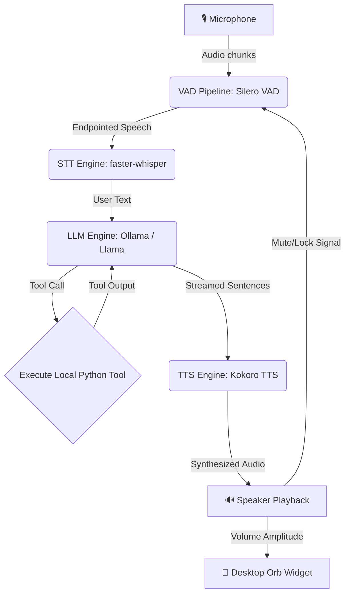

# Jarvis: Low-Latency Local Voice AI Assistant 🎙️🤖

[](#)
[](#)
[-blueviolet)](#)
[-orange)](#)
[-ff69b4)](#)
[](#)

Jarvis is a low-latency, fully offline, local voice assistant that runs entirely on your machine. It features highly responsive Voice Activity Detection (VAD), fast Speech-to-Text (STT) transcription, Language Model (LLM) orchestration with custom tool calling, real-time Text-to-Speech (TTS) audio streaming, and a gorgeous, Siri-like floating desktop widget that reacts in real-time.

---

## 🛠️ Architecture & Pipeline Flow

The system operates as an asynchronous, half-duplex voice pipeline designed to prevent acoustic echo feedback and maximize real-time streaming performance.



---

## 🌟 Core Features

*   **⚡ Sub-100ms First-Syllable Latency**: Optimized using real-time audio chunk streaming, Whisper VAD-bypass, and fine-tuned Ollama configurations.
*   **🔮 Siri-Like Desktop Orb**: A borderless, floating UI widget that breathes when listening, sways when thinking, and pulsates/scales dynamically in direct response to the speaker's volume (amplitude) when speaking.
*   **🔒 100% Offline & Private**: All models (Silero VAD, Whisper STT, Llama LLM, Kokoro TTS) run completely locally on your hardware.
*   **🔄 Configurable Barge-In (Full Duplex)**: Speak over the assistant to interrupt it at any time. Supports `smart` (volume-gated for speakers), `headphones` (fully duplex, open microphone), and `disabled` modes.
*   **🛡️ Echo & Loop Prevention**: Dynamic echo decay cooldown and amplitude thresholding to prevent the assistant from hearing and transcribing its own speech from speakers.
*   **🔧 Local Tool Plugins**: Python function plugins (e.g. checking local time, fetching weather info, toggling smart lights, and searching Wikipedia for real-time fact lookups).

---

## 📁 Codebase Directory Breakdown

*   [main.py](file:///Users/saikrishnaallam/Desktop/jarvis_ai/main.py) - The orchestrator that initializes all modules and launches asynchronous worker loops concurrently.
*   [audio_engine.py](file:///Users/saikrishnaallam/Desktop/jarvis_ai/audio_engine.py) - Handles microphone input, runs Silero VAD, manages the feedback/echo locks, and detects user speech onset.
*   [stt_engine.py](file:///Users/saikrishnaallam/Desktop/jarvis_ai/stt_engine.py) - Consumes speech buffers from the VAD queue and transcribes them asynchronously using `faster-whisper`.
*   [llm_engine.py](file:///Users/saikrishnaallam/Desktop/jarvis_ai/llm_engine.py) - Asynchronously coordinates conversation history, streams text responses sentence-by-sentence, and manages local tool calling.
*   [tts_engine.py](file:///Users/saikrishnaallam/Desktop/jarvis_ai/tts_engine.py) - Synthesizes spoken audio using Kokoro TTS and streams audio segments to the audio driver immediately as they are generated.
*   [ui_engine.py](file:///Users/saikrishnaallam/Desktop/jarvis_ai/ui_engine.py) - A Tkinter-based floating desktop widget providing live, animated visual feedback of the assistant's internal state.

---

## 🏎️ Core Latency & Technical Optimizations

We implemented several key refinements to ensure the voice agent is highly conversational and fluid:

*   **🎙️ Real-Time TTS Chunk Streaming**: Rather than waiting for the entire text response to be synthesized, Kokoro's pipeline generator is executed in a background worker thread. Synthesized audio segments are immediately pushed back to the main thread's audio playback queue using `loop.call_soon_threadsafe`, reducing the first-syllable startup latency to under **50ms**.
*   **🔄 Adaptive Echo-Gating (Smart Barge-In)**: The system dynamically calculates the Root Mean Square (RMS) amplitude of speaker playback. Microphone input is only gated (locked) if the mic input amplitude is less than `max(0.08, speaker_amplitude * 1.5)`. If the user speaks louder than the speaker volume threshold, the lock is released, and the VAD triggers an instant barge-in interrupt.
*   **🔇 Whisper VAD-Bypass**: By relying strictly on our primary Silero VAD endpoints for speech capture, we disabled the redundant second-pass VAD filtering in `faster-whisper` (`vad_filter=False`), saving **100–300ms** of transcription latency.
*   **⏳ Aggressive Silence Endpointing**: Configured the silence detection threshold to `0.35s` (down from `1.2s`) and reduced echo cooldown to `0.35s` to start STT transcription instantly after user speech finishes.
*   **🎨 macOS Cocoa Transparency Fix**: Standard transparent canvases in macOS Cocoa composite transparent PNG alpha channels against the transparent background window, rendering them completely invisible. We resolved this by drawing a solid white circular background (`canvas.create_oval`) behind the moving avatar matching its exact dynamic scale.
*   **♻️ Tkinter Garbage Collection Preservation**: Tkinter's C-bindings do not retain references to Python `PhotoImage` objects created dynamically during frame loops (30 FPS), resulting in visual glitches. We prevent this by storing explicit references on the canvas (`self.canvas.image = self.avatar_img`) to bypass Python garbage collection sweeps.
*   **greedy LLM Decoding**: Configured Ollama prompts with greedy decoding (`temperature: 0.0`), a smaller context history window (`num_ctx: 1024`), and short prediction lengths to avoid context-loading and generation overhead.

---

## 📦 Requirements & Local Installation

### Hardware Requirements
*   **Disk Space**: ~4.5 GB to 7.2 GB (Whisper, Kokoro, and Ollama Llama 3.2 model storage).
*   **RAM**: 8 GB minimum (16 GB recommended for GPU acceleration).

### System Dependencies
Ensure you have the PortAudio and system text-to-speech libraries installed:
*   **macOS (Homebrew)**:
    ```bash
    brew install portaudio espeak-ng
    ```
*   **Linux (Debian/Ubuntu)**:
    ```bash
    sudo apt-get install portaudio19-dev alsa-utils libasound2-dev espeak-ng
    ```

### Installation Steps

1.  **Install Python Packages**:
    ```bash
    pip install -r requirements.txt
    ```
2.  **Start Ollama Server**: Make sure your local [Ollama](https://ollama.com/) instance is running and pull the lightweight Llama 3.2 model:
    ```bash
    ollama pull llama3.2
    ```

---

## 🚀 Running the Application

### Start the full Assistant:
*   **Smart Mode** (Default - recommended for standard speakers):
    ```bash
    python main.py
    ```
*   **Headphones Mode** (Recommended for headphones - fully duplex, open microphone):
    ```bash
    python main.py --barge-in headphones
    ```
*   **Disabled Mode** (Traditional half-duplex mic lock during speaking):
    ```bash
    python main.py --barge-in disabled
    ```

### Start the Streamlit Web Dashboard:
To run the browser-based Jarvis Voice dashboard with animated orb visualizations, settings options, and voice controls, run:
```bash
streamlit run app_streamlit.py
```

### Standalone UI Testing:
To test the floating desktop widget in isolation (which cycles through visual states and tests the dynamic avatar scaling), run:
```bash
python ui_engine.py
```

### Running Unit Tests:
To run the automated unittest suite (which tests custom tools, Wikipedia search integration, memory pruning, VAD modes, and system formats), run:
```bash
python -m unittest test_jarvis.py
```

### Docker Deployment (Linux only)
To build and run the assistant container, exposing your audio hardware driver:
```bash
docker build -t local-voice-ai .
docker run -it --device /dev/snd --network host local-voice-ai
```
