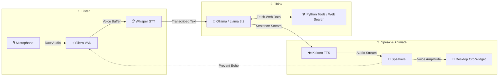

# Jarvis: Low-Latency Local Voice AI Assistant 🎙️🤖

[](#)
[](#)
[-blueviolet)](#)
[-orange)](#)
[-ff69b4)](#)
[](#)

**Jarvis** is a private, low-latency voice assistant that runs **100% locally** on your machine. It combines voice activity detection (VAD), fast speech transcription, local LLM orchestration with web tools, instant voice synthesis, and a animated floating desktop widget.

---

## ⚡ Quick Start (Run in 3 Steps)

### 1. Install Dependencies
```bash
# macOS (Homebrew)
brew install portaudio espeak-ng

# Install Python packages
pip install -r requirements.txt
```

### 2. Pull Local Model (Ollama)
```bash
ollama pull llama3.2
```

### 3. Launch Jarvis!
```bash
python main.py
```

---

## 🌟 Why Use Jarvis?

- **⚡ Instant Response (Sub-50ms Latency)**: Answers begin speaking within milliseconds thanks to real-time audio chunk streaming.
- **🔮 Siri-Like Desktop Widget**: A floating, borderless orb that breathes, sways, and pulsates in real time to your voice and Jarvis's speech. Click and drag it anywhere on your screen.
- **🔒 100% Private & Local**: Core voice models run on your device without sending voice data to external servers.
- **🔄 Full Duplex Barge-In**: Interrupt Jarvis anytime while speaking—just talk over the assistant.
- **🌐 Real-Time Web Info**: Answers questions about live news, real-time stock prices (Tesla, Apple, Nvidia, etc.), weather, and current political leaders.

---

## 🛠️ How It Works (Architecture Flow)

Data moves continuously through **3 simple stages**:



### End-to-End Pipeline Summary:
1. **Listen (VAD & STT)**: Microphone audio is monitored by **Silero VAD** for speech endpoints, then transcribed into text using **faster-whisper**.
2. **Think (LLM & Tools)**: **Ollama (Llama 3.2)** reads the prompt. If query requires current facts or real-time info, Python tools (DuckDuckGo, Yahoo Finance, Google News) fetch data automatically.
3. **Speak & Animate (TTS & UI)**: Text is converted into 24kHz spoken audio using **Kokoro TTS** and played over speakers while dynamically animating the **Desktop Orb Widget**.

---

## 🧰 Available Tools & Capabilities

Jarvis automatically chooses the right tool depending on what you ask:

| Capability | Trigger Example | Executed Tool | Source |
| :--- | :--- | :--- | :--- |
| **📈 Real-Time Stocks** | *"What's Tesla stock price?"* | `search_web` | Yahoo Finance API |
| **🌐 Live Web Search** | *"Who won the match today?"* | `search_web` | DuckDuckGo |
| **🏛️ Political Leaders** | *"Who is the prime minister of UK?"* | `search_web` | Live Web Lookup |
| **📰 Global Breaking News** | *"What is the latest news?"* | `get_latest_news` | Google News RSS |
| **📚 General Facts** | *"Tell me about Quantum Computing"* | `search_wikipedia` | Wikipedia API |
| **☀️ Local Weather** | *"What's the weather in Miami?"* | `get_weather` | OpenWeather API |
| **💡 Smart Lights** | *"Turn on the kitchen lights"* | `toggle_smart_lights` | Smart Home Controller |
| **⏰ Local Time** | *"What time is it?"* | `get_current_time` | System Clock |

---

## 📁 Codebase Guide

| File | Purpose |
| :--- | :--- |
| **[main.py](main.py)** | App launcher & async task orchestrator. |
| **[audio_engine.py](audio_engine.py)** | Handles microphone input, Silero VAD, and echo prevention. |
| **[stt_engine.py](stt_engine.py)** | Speech-to-text processing powered by `faster-whisper`. |
| **[llm_engine.py](llm_engine.py)** | LLM manager, prompt template, tool routing, and memory buffer. |
| **[tts_engine.py](tts_engine.py)** | Kokoro TTS audio generator & sound playback worker. |
| **[ui_engine.py](ui_engine.py)** | Animated Tkinter desktop orb widget with click-and-drag support. |
| **[test_jarvis.py](test_jarvis.py)** | Automated unit test suite. |

---

## ⚙️ Configuration & Options

### Change Barge-In (Interruption) Mode:
```bash
# Smart Mode (Default - volume gated for speakers)
python main.py --barge-in smart

# Headphones Mode (Full duplex, open microphone)
python main.py --barge-in headphones

# Disabled Mode (Mic locked while assistant speaks)
python main.py --barge-in disabled
```

### Change Speech Recognition (STT) Model:
```bash
# Choose model size: tiny.en, base.en (default), small.en, medium.en
python main.py --stt-model small.en
```

---

## 🧪 Testing & Verification

### Run Unit Tests:
```bash
python -m unittest test_jarvis.py
```

### Test UI Widget Independently:
```bash
python ui_engine.py
```

### Docker Deployment (Linux):
```bash
docker build -t local-voice-ai .
docker run -it --device /dev/snd --network host local-voice-ai
```

---

## 📜 Recent Updates

- ✨ **Deterministic Tool Routing**: Prevents LLM tool hallucinations by passing only relevant tool schemas.
- 🎯 **Enhanced STT**: Default model upgraded to `base.en` with `--stt-model` selection flag.
- 📈 **Live Market & News Data**: Integrated real-time Yahoo Finance stock lookups and Google News RSS headlines.
- 🔮 **Desktop Orb Dragging**: Added click-and-drag mouse positioning for the floating desktop widget.

---

## 📄 License

Distributed under the MIT License.
