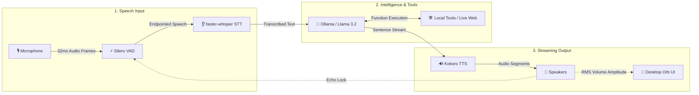

# 🎙️ Jarvis: Low-Latency Local Voice AI Assistant

[](#)
[](#)
[](#)
[](#)
[](#)
[](#)

> **Jarvis** is a low-latency, privacy-focused, local-first voice assistant engineered to run **100% on your machine**. It combines sub-millisecond Voice Activity Detection (VAD), CTranslate2-accelerated Speech-to-Text (STT), local LLM orchestration with live web search & stock market tools, streaming Text-to-Speech (TTS), and a floating animated Siri-like desktop orb widget.

---

## 🌟 Core Value Pillars

```
+-----------------------------------------------------------------------------------+
|  🔒 100% Local & Private     |  ⚡ Sub-280ms Latency     |  🔮 Siri-Like Desktop Orb |
|  Runs entirely on-device;    |  Real-time audio streaming|  Floating animated UI with|
|  zero cloud API data leaks.  |  with instant sentence TTS|  volume-reactive visuals. |
+-----------------------------------------------------------------------------------+
|  🔄 Smart Barge-In           |  🌐 Real-Time Web Tools   |  🚀 Auto Acceleration     |
|  Interrupt mid-speech; RMS   |  Live DuckDuckGo search,  |  Hardware accelerated on  |
|  volume echo-suppression.    |  Yahoo Finance & RSS news.|  Apple MPS & NVIDIA CUDA. |
+-----------------------------------------------------------------------------------+
```

---

## ⚡ Quick Start (3 Steps)

### 1. Install System Dependencies & Python Packages
```bash
# macOS (via Homebrew)
brew install portaudio espeak-ng

# Linux (Debian/Ubuntu)
sudo apt-get update && sudo apt-get install -y portaudio19-dev alsa-utils libasound2-dev espeak-ng

# Install Python requirements
pip install -r requirements.txt
```

### 2. Pull Local LLM Model (Ollama)
Ensure [Ollama](https://ollama.com/) is running on your machine:
```bash
ollama pull llama3.2
```

### 3. Launch Jarvis!
```bash
python main.py
```

---

## 🛠️ Architecture Overview

Jarvis uses an asynchronous, non-blocking audio pipeline designed to stream speech buffers in real time without dropping microphone frames.



---

## 🌐 Integrated Capabilities & Tools

Jarvis automatically routes queries to local tools when real-time data or system interaction is requested:

| Capability | Example Query | Tool Executed | Data Source |
| :--- | :--- | :--- | :--- |
| **📈 Real-Time Stocks** | *"What is Tesla's stock price today?"* | `search_web` | Yahoo Finance API (`TSLA`, `AAPL`, `MSFT`, `NVDA`, etc.) |
| **🌐 Live Web Search** | *"Who won the game today?"* | `search_web` | DuckDuckGo Search API |
| **📰 Breaking Global News** | *"What is the latest breaking news?"* | `get_latest_news` | Google News RSS Feed |
| **📚 General Knowledge** | *"Tell me about Quantum Computing"* | `search_wikipedia` | Wikipedia REST API |
| **☀️ Live Weather** | *"What's the weather in Tokyo?"* | `get_weather` | OpenWeather API |
| **💡 Smart Home Control** | *"Turn off the living room lights"* | `toggle_smart_lights` | Smart Home REST API |
| **⏰ Local Time** | *"What time is it right now?"* | `get_current_time` | System Clock |

---

## 🔮 Floating Desktop Orb UI

Built with Tkinter, the floating desktop orb provides live visual state feedback:

* **`IDLE`**: Soft breathing white glow ring.
* **`LISTENING`**: Pulsing cyan/blue audio capture ring.
* **`THINKING`**: Rotating magenta/purple morphing sway ring.
* **`SPEAKING`**: Dynamic green/teal ring scaling with speaker volume amplitude.

> **Tip**: Click and drag the floating orb widget anywhere on your desktop screen.

---

## ⚙️ Launch Options & Commands

```bash
# Default Smart Mode (RMS volume-gated acoustic lock for speakers)
python main.py

# Headphones Mode (Full duplex open mic - recommended for headsets)
python main.py --barge-in headphones

# Disabled Mode (Traditional half-duplex mic lock during speech output)
python main.py --barge-in disabled

# Specify custom Whisper STT model size
python main.py --stt-model small.en

# Run UI widget animation test
python ui_engine.py

# Run automated unit test suite
python -m unittest test_jarvis.py
```

---

## 📁 Codebase Directory Breakdown

* **[main.py](main.py)**: System entry point. Manages background async worker loops, signal handlers (`SIGINT`/`SIGTERM`), and main-thread Cocoa GUI loops.
* **[audio_engine.py](audio_engine.py)**: Manages PyAudio microphone input streams, Silero VAD edge processing, and acoustic echo locks.
* **[stt_engine.py](stt_engine.py)**: Asynchronously transcribes speech audio buffers using `faster-whisper` (CTranslate2).
* **[llm_engine.py](llm_engine.py)**: Ollama chat orchestrator with memory buffer pruning (20 messages max), regex sentence chunking, and deterministic keyword tool routing.
* **[tts_engine.py](tts_engine.py)**: Synthesizes high-quality speech using Kokoro TTS (MPS/CUDA hardware-accelerated) and streams audio to speakers.
* **[ui_engine.py](ui_engine.py)**: Floating Tkinter desktop widget rendering dynamic visual states (`IDLE`, `LISTENING`, `THINKING`, `SPEAKING`).
* **[test_jarvis.py](test_jarvis.py)**: Automated unit test suite covering tool keyword routing, memory pruning, and parameter extraction.
* **[Dockerfile](Dockerfile)**: Linux container configuration exposing host audio devices (`/dev/snd`).

---

## 📄 License

Distributed under the **MIT License**. See `LICENSE` for details.
