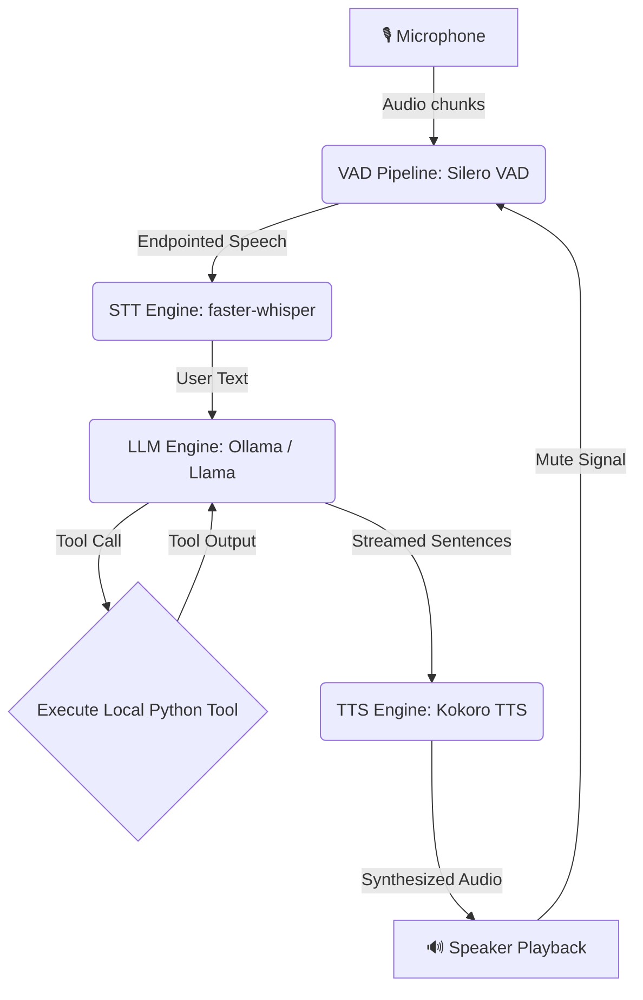

# Jarvis Local Voice AI Assistant


-blueviolet)
-orange)
-ff69b4)


A low-latency, fully offline, local voice assistant that runs entirely on your machine. It features Voice Activity Detection (VAD), Speech-to-Text (STT) transcription, Language Model (LLM) orchestration with Tool Calling, and Text-to-Speech (TTS) audio playback.

---

## Project Overview

This project implements a local "Jarvis" voice agent. The system is designed to be highly responsive, interactive, and private.



### Key Technical Improvements Made:
1. **Acoustic Feedback Loop Prevention**: Added a turn-based (Half-Duplex) listening lock. When the speaker is playing, the VAD ignores the microphone input so the assistant never listens to or responds to its own voice.
2. **Reverberation/Echo Guard**: Implemented a `1.0-second cooldown` after speech playback ends to allow room echo to clear before the microphone starts listening again.
3. **Mid-Word Audio Fragmentation Fix**: Resolved a regex sentence-boundary bug where numeric lists (e.g. `"5. "`) split words in half (e.g., `"5. Impro"` and `"ving people's..."`). The stream parser now uses a negative lookbehind `(?<!\d)` to ignore numbers, and splits precisely at the end of punctuation.
4. **Latency Reductions**:
   - **VAD Endpointing**: Reduced silence window from `1.2s` to `0.8s` so the assistant starts generating responses 400ms faster.
   - **STT Model**: Downsized from `base` to `tiny.en` to drop transcription latency from 1.5s to **~0.3s**.
   - **TTS Accelerator**: Configured Kokoro to run on Apple Silicon GPU (`mps` - Metal Performance Shaders) dropping audio generation latency to **~0.4s**.
5. **Interactive Keyboard Barge-In**: Running in a console environment means software Acoustic Echo Cancellation is not available. To allow natural conversation, we implemented a background keyboard listener: press `Enter` in the terminal to instantly interrupt Jarvis, stop speech synthesis, and start speaking immediately.

---

## Features

- **🎙️ Real-time VAD**: Uses **Silero VAD** for sub-millisecond edge processing to detect speech onset and endpointing.
- **👂 Speech-to-Text (STT)**: Powered by **faster-whisper** (`tiny.en`) for fast, local transcription.
- **🧠 Async LLM & Tool Calling**: Utilizes Ollama's asynchronous client (`AsyncClient`) for real-time sentence streaming and local function execution (e.g., getting weather, checking time, and smart home lighting controls).
- **🔊 Text-to-Speech (TTS)**: Powered by **Kokoro TTS** (high-quality American English voice `af_heart`) streaming audio to speakers via PortAudio (`sounddevice`).
- **🐳 Containerized Deployment**: Complete `Dockerfile` setup for ALSA and PortAudio Linux builds.

---

## Project Structure

- [audio_engine.py](file:///Users/saikrishnaallam/Desktop/jarvis_ai/audio_engine.py): Captures microphone input, runs Silero VAD, manages the VAD lock, and triggers user barge-in events.
- [stt_engine.py](file:///Users/saikrishnaallam/Desktop/jarvis_ai/stt_engine.py): Consumes speech buffers and transcribes them asynchronously in background threads.
- [llm_engine.py](file:///Users/saikrishnaallam/Desktop/jarvis_ai/llm_engine.py): Asynchronously orchestrates memory buffers, stream parsing, and handles local tool calling (weather, lights, time).
- [tts_engine.py](file:///Users/saikrishnaallam/Desktop/jarvis_ai/tts_engine.py): Synthesizes audio sentences and handles streaming playback via sounddevice.
- [main.py](file:///Users/saikrishnaallam/Desktop/jarvis_ai/main.py): Central entry point that coordinates the worker loops concurrently.

---

## Requirements & Setup

### Local Installation (macOS & Linux)
Ensure you have the PortAudio and system dependencies installed:
- **macOS (Homebrew)**:
  ```bash
  brew install portaudio espeak-ng
  ```
- **Linux (Debian/Ubuntu)**:
  ```bash
  sudo apt-get install portaudio19-dev alsa-utils libasound2-dev espeak-ng
  ```

Install Python dependencies:
```bash
pip install -r requirements.txt
```

Ensure your local **Ollama** server is running, and pull your model of choice (e.g., `llama3.1` or the faster `llama3.2`):
```bash
ollama pull llama3.1
```

### Running Locally
Start the assistant:
```bash
python main.py
```

### Docker Deployment (Linux only)
To build the local Docker image:
```bash
docker build -t local-voice-ai .
```

To run the container (exposing your host's audio hardware device and using host networking for Ollama connectivity):
```bash
docker run -it \
  --device /dev/snd \
  --network host \
  local-voice-ai
```
