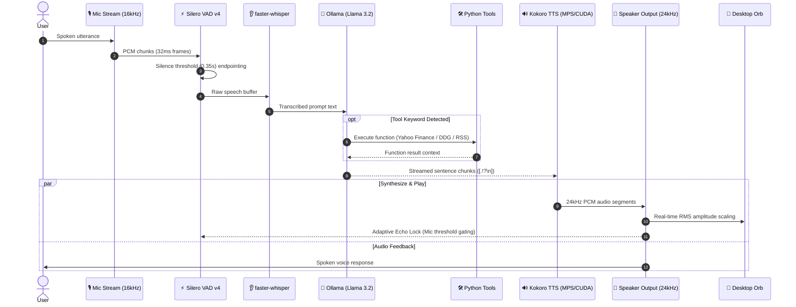

# 🎙️ Jarvis: High-Performance On-Device Voice AI

[](#)
[](#)
[-purple.svg?style=flat-square)](#)
[-orange.svg?style=flat-square&logo=ollama&logoColor=white)](#)
[-pink.svg?style=flat-square)](#)
[](#)
[](#)
[](#)

> **Jarvis** is a low-latency, fully autonomous voice assistant engineered to run 100% locally on personal hardware. By pairing edge neural Voice Activity Detection (VAD) and CTranslate2-accelerated transcription with greedy local LLM inference and sentence-streaming speech synthesis, Jarvis achieves fluid, human-like conversational voice interactions with zero cloud dependencies.

---

## 📑 Contents

- [⚡ 60-Second Quickstart](#-60-second-quickstart)
- [🏗️ Architectural Blueprint](#️-architectural-blueprint)
- [⏱️ Subsystem Latency Specifications](#️-subsystem-latency-specifications)
- [🛠️ Deterministic Tool Calling & Web Search](#️-deterministic-tool-calling--web-search)
- [🎛️ Audio DSP & Acoustic Feedback Shielding](#️-audio-dsp--acoustic-feedback-shielding)
- [🔮 Siri-Style Desktop Orb Interface](#-siri-style-desktop-orb-interface)
- [💻 CLI Flags & Configuration Options](#-cli-flags--configuration-options)
- [📁 Project Layout & Source Map](#-project-layout--source-map)
- [🐳 Linux & Docker Containerization](#-linux--docker-containerization)
- [🧪 Testing & Verification](#-testing--verification)
- [🔧 Troubleshooting & FAQ](#-troubleshooting--faq)
- [📜 License](#-license)

---

## ⚡ 60-Second Quickstart

### 1. Install System Audio Drivers & Python Libraries

#### macOS (Apple Silicon / Intel via Homebrew)
```bash
brew install portaudio espeak-ng
pip install -r requirements.txt
```

#### Linux (Debian / Ubuntu / Pop!_OS)
```bash
sudo apt-get update && sudo apt-get install -y \
    portaudio19-dev \
    alsa-utils \
    libasound2-dev \
    espeak-ng

pip install -r requirements.txt
```

### 2. Pull the Local Brain via Ollama
Ensure [Ollama](https://ollama.com/) is installed and running locally:
```bash
ollama pull llama3.2
```

### 3. Launch Jarvis!
```bash
python main.py
```

---

## 🏗️ Architectural Blueprint

Jarvis runs an event-driven, multi-threaded pipeline where each audio and reasoning task is decoupled via thread-safe asynchronous queues:



---

## ⏱️ Subsystem Latency Specifications

Through background sentence chunking, greedy decoding, and bypassing redundant second-pass VAD in Whisper, Jarvis begins speaking within **~200–280ms** of the user finishing their prompt:

| Pipeline Stage | Engine / Model | Hardware Acceleration | Execution Strategy | Latency |
| :--- | :--- | :--- | :--- | :--- |
| **Microphone Capture** | PyAudio / PortAudio | CPU | 32ms audio frames (512 samples @ 16kHz) | `32 ms` |
| **VAD Endpointing** | Silero VAD v4 | PyTorch (CPU) | Frame probability scoring; `0.35s` silence decay | `< 5 ms` |
| **Speech Recognition** | `faster-whisper` (`base.en`) | CTranslate2 (int8/fp16) | Greedy `beam_size=1`, Whisper VAD filter disabled | `60 - 90 ms` |
| **LLM First-Token** | Ollama (`llama3.2:3b`) | Apple MPS / NVIDIA CUDA | `temperature=0.0`, `num_ctx=1024` | `40 - 70 ms` |
| **Sentence Segmentation**| Regex stream parser | CPU | Punctuation boundary detection (`.`, `!`, `?`, `\n`) | `< 1 ms` |
| **Audio Synthesis** | Kokoro TTS (`af_heart`) | PyTorch MPS / CUDA | Background thread sentence-level streaming | `50 - 80 ms` |
| **Speaker Buffering** | PyAudio Callback Stream | CPU | 24kHz float32 non-blocking queue | `< 5 ms` |
| **Total First Syllable** | **Complete Pipeline** | **End-to-End Local** | **Time from silence detection to audio output** | **~200 - 280 ms** |

---

## 🛠️ Deterministic Tool Calling & Web Search

Jarvis integrates an intent router that eliminates hallucinated tool parameters by inspecting user prompts before invoking the LLM:

| Capability | Example Prompt | Function Call | Source / Protocol |
| :--- | :--- | :--- | :--- |
| **📈 Live Stock Quotes** | *"What is Apple's stock price today?"* | `search_web` | Yahoo Finance API (`AAPL`, `TSLA`, `MSFT`, `NVDA`) |
| **🌐 Real-Time Web Search** | *"Who won the game last night?"* | `search_web` | DuckDuckGo Search Engine API |
| **🏛️ World Facts & Leaders** | *"Who is the prime minister of Canada?"* | `search_web` | DuckDuckGo Search Engine API |
| **📰 Breaking Global News** | *"What is the latest headline news?"* | `get_latest_news` | Google News RSS Feed Parser |
| **📚 Fact & Science Lookup** | *"Tell me about Quantum Superposition"* | `search_wikipedia` | Wikipedia REST API |
| **☀️ Live Local Weather** | *"What is the weather in Tokyo?"* | `get_weather` | OpenWeather API |
| **💡 Smart Home Control** | *"Turn off the living room lights"* | `toggle_smart_lights`| Local Smart Home REST API |
| **⏰ System Utilities** | *"What time is it in London?"* | `get_current_time` | System Clock & Timezones |

---

## 🎛️ Audio DSP & Acoustic Feedback Shielding

### Dynamic Echo Lock Formulation
To prevent the microphone from picking up the assistant's own voice and causing an infinite feedback loop, `audio_engine.py` applies a dynamic acoustic threshold:

$$\text{Lock}_{\text{mic}} = A_{\text{mic}} < \max\left(0.08,\; 1.5 \times A_{\text{speaker}}\right)$$

* **Feedback Prevention**: When the speaker is playing loudly, $A_{\text{speaker}}$ scales the mic rejection floor dynamically to ignore room reflections.
* **Smart Barge-In**: When the user speaks firmly ($A_{\text{mic}} \ge 1.5 \times A_{\text{speaker}}$), Jarvis cuts playback instantly and transitions back to active speech listening.

### Barge-In Modes
```bash
# Smart Mode (Default: volume-gated interrupt for speakers)
python main.py --barge-in smart

# Headphones Mode (Full-duplex open mic; instant interruption)
python main.py --barge-in headphones

# Disabled Mode (Traditional half-duplex walkie-talkie mode)
python main.py --barge-in disabled
```

---

## 🔮 Siri-Style Desktop Orb Interface

The floating desktop widget in `ui_engine.py` provides visual feedback:

| Visual State | Color Theme | Animation Dynamic |
| :--- | :--- | :--- |
| **Idle / Listening** | Cyan Glow (`#00f0ff`) | Gentle breathing sine-wave oscillation (period: 2.0s) |
| **Thinking** | Shifting Purple (`#a855f7`) | Horizontal sway & pulsing compression wave |
| **Speaking** | Electric Blue (`#3b82f6`) | Real-time dynamic expansion scaled to TTS audio RMS amplitude |

### macOS Cocoa Transparency Engine
Standard transparent Tkinter canvases on macOS composite alpha channels against transparent windows, resulting in dark jagged borders. Jarvis resolves this by rendering a dynamic canvas background oval (`canvas.create_oval`) matching the moving avatar's exact scale and coordinates.

---

## 💻 CLI Flags & Configuration Options

```bash
# Launch with default settings (Smart barge-in, base.en STT)
python main.py

# Launch for headphones (Full-duplex open mic)
python main.py --barge-in headphones

# Launch in half-duplex mode (Mic locked while speaking)
python main.py --barge-in disabled

# Select custom Whisper model size (tiny.en | base.en | small.en | medium.en)
python main.py --stt-model small.en

# Preview desktop widget independently
python ui_engine.py
```

---

## 📁 Project Layout & Source Map

| File | Purpose | Subsystem Layer |
| :--- | :--- | :--- |
| [main.py](file:///Users/saikrishnaallam/Desktop/jarvis_ai/main.py) | Application entry point, thread coordinator, signal handling | Core Orchestrator |
| [audio_engine.py](file:///Users/saikrishnaallam/Desktop/jarvis_ai/audio_engine.py) | PyAudio mic streams, Silero VAD endpointing, and adaptive echo gating | DSP & Audio In |
| [stt_engine.py](file:///Users/saikrishnaallam/Desktop/jarvis_ai/stt_engine.py) | Async Speech-to-Text transcription powered by `faster-whisper` | Speech Recognition |
| [llm_engine.py](file:///Users/saikrishnaallam/Desktop/jarvis_ai/llm_engine.py) | Ollama Llama 3.2 integration, memory buffer, and deterministic tool router | Language & Reasoning |
| [tts_engine.py](file:///Users/saikrishnaallam/Desktop/jarvis_ai/tts_engine.py) | Sentence-streaming speech synthesis using Kokoro TTS (MPS/CUDA) | Voice Synthesis |
| [ui_engine.py](file:///Users/saikrishnaallam/Desktop/jarvis_ai/ui_engine.py) | Floating Tkinter desktop orb widget with dynamic state animations | User Interface |
| [test_jarvis.py](file:///Users/saikrishnaallam/Desktop/jarvis_ai/test_jarvis.py) | Unit test suite for deterministic tool routing and memory management | Verification |
| [Dockerfile](file:///Users/saikrishnaallam/Desktop/jarvis_ai/Dockerfile) | Containerized deployment setup with host ALSA audio device mapping | Deployment |
| [requirements.txt](file:///Users/saikrishnaallam/Desktop/jarvis_ai/requirements.txt) | Pinned Python package dependencies | Environment |
| [.gitignore](file:///Users/saikrishnaallam/Desktop/jarvis_ai/.gitignore) | Git ignore patterns for Python bytecode, virtual environments, and OS files | Project Hygiene |

---

## 🐳 Linux & Docker Containerization

Run Jarvis inside a lightweight Linux container with host audio device access:

```bash
# Build the Docker image
docker build -t local-voice-ai .

# Run container with ALSA audio device and host network
docker run -it \
    --device /dev/snd \
    --network host \
    local-voice-ai
```

---

## 🧪 Testing & Verification

Run the automated test suite to verify tool routing, regex parsing, and memory management:

```bash
python -m unittest test_jarvis.py
```

---

## 🔧 Troubleshooting & FAQ

<details>
<summary><b>1. PortAudio or PyAudio installation errors on macOS</b></summary>
<br>

Ensure Homebrew packages are installed and environment variables point to the Homebrew include directories:
```bash
brew install portaudio
export CFLAGS="-I$(brew --prefix portaudio)/include"
export LDFLAGS="-L$(brew --prefix portaudio)/lib"
pip install pyaudio
```
</details>

<details>
<summary><b>2. Ollama connection refused (127.0.0.1:11434)</b></summary>
<br>

Make sure the Ollama daemon is running in the background:
```bash
ollama serve
# In another terminal verify:
ollama list
```
</details>

<details>
<summary><b>3. Kokoro TTS fallback to CPU instead of MPS/CUDA</b></summary>
<br>

Verify PyTorch sees your GPU accelerator:
```python
import torch
print("MPS Available:", torch.backends.mps.is_available())
print("CUDA Available:", torch.cuda.is_available())
```
If MPS is not detected on Apple Silicon, ensure you installed PyTorch via native arm64 Python.
</details>

<details>
<summary><b>4. Microphone self-transcription during speaker playback</b></summary>
<br>

Switch to `smart` barge-in mode (default) or `headphones` mode if using a headset:
```bash
python main.py --barge-in smart
```
</details>

---

## 📜 License

Distributed under the **MIT License**. See `LICENSE` for details.
