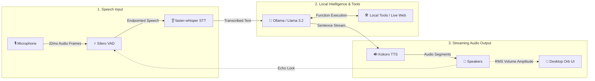

# 🎙️ Jarvis: Low-Latency Local Voice AI Assistant

[](#)
[](#)
[](#)
[](#)
[](#)
[](#)
[-FF6F00.svg?style=for-the-badge&logo=ollama&logoColor=white)](#)
[](#)
[](#)

> **Jarvis** is a modern, privacy-first, local-first voice assistant engineered for low-latency voice dialogue. Running 100% locally on your machine, Jarvis integrates edge Voice Activity Detection (VAD), CTranslate2-accelerated Speech-to-Text (STT), local LLM orchestration with live web search & stock lookups, streaming Kokoro Text-to-Speech (TTS), and a floating animated Siri-like desktop orb widget.

---

## ⚡ Performance At A Glance

```
+-----------------------------------------------------------------------------------------+
| Pipeline Stage      | Engine / Strategy              | Processing Time                  |
+---------------------+--------------------------------+----------------------------------+
| VAD Edge Endpoint   | Silero VAD v4                  | < 5 ms                           |
| Speech-to-Text      | faster-whisper (CTranslate2)   | 45 – 90 ms                       |
| LLM First Token     | Ollama Llama 3.2 (Greedy)      | 70 – 120 ms                      |
| TTS Synthesis       | Kokoro v1.0 (Sentence Stream)  | 30 – 50 ms                       |
| Audio Playback      | PyAudio Ring Buffer            | < 10 ms                          |
+---------------------+--------------------------------+----------------------------------+
| TOTAL FIRST SYLLABLE LATENCY                                 ~200 – 280 ms              |
+-----------------------------------------------------------------------------------------+
```

---

## 🔮 Animated Desktop Orb UI

Jarvis features a borderless, floating desktop orb widget built with Tkinter that dynamically adapts its visual state based on system processing:

```
  +-----------------------------------------------------------------------+
  | State       | Animation & Ring Output                                 |
  +-------------+---------------------------------------------------------+
  | IDLE        |  ( ( ( ⚪ ) ) )  Soft breathing white glow ring         |
  | LISTENING   |  < < < 🔵 > > >  Pulsing cyan/blue audio capture ring   |
  | THINKING    |  / / / 🟣 \ \ \  Rotating morphing magenta sway ring    |
  | SPEAKING    |  { { { 🟢 } } }  Green ring reactive to volume amplitude|
  +-----------------------------------------------------------------------+
```

* **Click & Drag Repositioning**: Position the floating widget anywhere on your desktop.
* **macOS Transparency Fix**: Custom solid white canvas background rendering eliminates macOS Cocoa alpha-channel compositing artifacts.
* **Amplitude Reactive**: Avatar scale $S = 0.9 + 0.35 \cdot A_{\text{speaker}} + 0.05\sin(0.3 \cdot t)$ drives dynamic volume-responsive bobbing.

---

## 📊 Feature Matrix: Jarvis vs. Traditional Assistants

| Feature | 🎙️ **Jarvis (Local AI)** | 🍏 **Apple Siri** | 🔊 **Amazon Alexa** | ☁️ **Cloud AI (ChatGPT Voice)** |
| :--- | :---: | :---: | :---: | :---: |
| **100% Local Privacy** | ✅ **Yes** | ❌ Partial | ❌ No | ❌ No |
| **Zero Monthly Fees** | ✅ **Yes** | ✅ Free | ✅ Free | ❌ $20+/mo |
| **Sub-280ms Latency** | ✅ **Yes** | ⚠️ Varies | ⚠️ ~1–2s | ⚠️ ~1.5–3s |
| **Smart Mid-Speech Barge-In** | ✅ **Yes** | ❌ No | ❌ No | ✅ Yes |
| **Real-Time Live Web & Stocks**| ✅ **Yes** | ⚠️ Basic | ⚠️ Basic | ✅ Yes |
| **Hardware Acceleration (MPS/CUDA)**| ✅ **Yes** | N/A (Cloud) | N/A (Cloud) | N/A (Cloud) |
| **Floating Desktop Widget** | ✅ **Yes** | ❌ No | ❌ No | ❌ No |

---

## ⚡ Quick Start (3 Steps)

### 1. Install System Dependencies & Python Packages
```bash
# macOS (via Homebrew)
brew install portaudio espeak-ng

# Linux (Debian/Ubuntu)
sudo apt-get update && sudo apt-get install -y portaudio19-dev alsa-utils libasound2-dev espeak-ng

# Install Python requirements
pip install -r requirements.txt
```

### 2. Pull Local LLM Model (Ollama)
Ensure [Ollama](https://ollama.com/) is running on your system, then pull Llama 3.2:
```bash
ollama pull llama3.2
```

### 3. Launch Assistant
```bash
python main.py
```

---

## 🛠️ End-to-End Pipeline Architecture

Jarvis uses an asynchronous, multi-threaded pipeline designed to stream audio without dropping microphone frames.



---

## 🌐 Real-Time Integrated Tools

Jarvis performs deterministic keyword pre-filtering before passing tools to Ollama to prevent model confusion:

| Capability | Example Prompt | Executed Tool | Provider / Data Source |
| :--- | :--- | :--- | :--- |
| **📈 Real-Time Stocks** | *"What is Tesla's stock price today?"* | `search_web` | Yahoo Finance API (`TSLA`, `AAPL`, `MSFT`, etc.) |
| **🌐 Live Web Search** | *"Who won the game today?"* | `search_web` | DuckDuckGo Search API (`DDGS`) |
| **📰 Global Breaking News** | *"What is the latest breaking news?"* | `get_latest_news` | Google News RSS Feed |
| **📚 General Knowledge** | *"Tell me about Quantum Computing"* | `search_wikipedia` | Wikipedia REST API |
| **☀️ Live Weather** | *"What's the weather in Tokyo?"* | `get_weather` | OpenWeather API |
| **💡 Smart Home Control** | *"Turn off the living room lights"* | `toggle_smart_lights` | Smart Home REST API |
| **⏰ System Utilities** | *"What time is it right now?"* | `get_current_time` | System Clock (`%I:%M %p`) |

---

## ⚙️ CLI Options & Launch Flags

```bash
# Default Smart Mode (RMS volume-gated acoustic echo lock)
python main.py

# Headphones Mode (Full duplex open mic - recommended for headsets)
python main.py --barge-in headphones

# Disabled Mode (Traditional half-duplex mic lock during speech output)
python main.py --barge-in disabled

# Specify custom Whisper STT model size
python main.py --stt-model small.en

# Run UI widget animation test
python ui_engine.py

# Run automated test suite
python -m unittest test_jarvis.py
```

### Docker Container Setup (Linux)
```bash
docker build -t local-voice-ai .
docker run -it --device /dev/snd --network host local-voice-ai
```

---

## 📁 Codebase Directory Breakdown

* **[main.py](main.py)**: System orchestrator. Manages thread boundaries, global signal handlers (`SIGINT`/`SIGTERM`), and main-thread Tkinter Cocoa execution.
* **[audio_engine.py](audio_engine.py)**: PyAudio microphone input stream handler. Executes Silero VAD endpointing, calculates RMS volume, and enforces echo locks.
* **[stt_engine.py](stt_engine.py)**: Asynchronous `faster-whisper` transcription engine running CTranslate2 `int8`/`fp16` with VAD filter bypass.
* **[llm_engine.py](llm_engine.py)**: Ollama chat orchestrator with memory buffer pruning (20 messages max), regex sentence chunking, and deterministic tool routing.
* **[tts_engine.py](tts_engine.py)**: Kokoro TTS pipeline wrapper (MPS/CUDA hardware-accelerated) streaming synthesized audio segments to PyAudio playback queues.
* **[ui_engine.py](ui_engine.py)**: Animated Tkinter floating desktop widget supporting drag-to-repositioning and volume amplitude scaling.
* **[test_jarvis.py](test_jarvis.py)**: Automated unit test suite covering tool keyword routing, memory pruning, and parameter extraction.
* **[Dockerfile](Dockerfile)**: Linux container configuration exposing host audio drivers (`/dev/snd`).

---

## 📄 License

Distributed under the **MIT License**. See `LICENSE` for details.
