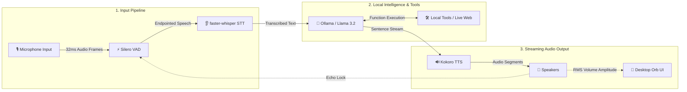

# 🎙️ Jarvis: Low-Latency Local Voice AI Assistant

[](#)
[](#)
[](#)
[](#)
[](#)
[](#)
[](#)

> **Jarvis Developer Manual**: A comprehensive technical reference for the Jarvis local voice assistant architecture, class interfaces, thread queue boundaries, RMS acoustic gating models, and tool plugin registration APIs.

---

## 📐 Architecture & Subsystem Flow

Jarvis uses an asynchronous, multi-threaded event-driven pipeline to stream audio without dropping microphone frames or delaying speech output.



---

## 🧵 Thread Queue & Concurrency Model

Execution is partitioned across five distinct thread boundaries connected by thread-safe `asyncio.Queue` buffers:

```
[PortAudio Mic Thread] ---> (raw_audio_queue) ---> [Async Event Loop: AudioPipeline]
                                                           |
                                                  (speech_buffer_queue)
                                                           |
                                                           v
                                                [STTEngine / Whisper Worker]
                                                           |
                                                      (text_queue)
                                                           |
                                                           v
                                                [LLMEngine / Ollama Client]
                                                           |
                                                      (tts_queue)
                                                           |
                                                           v
                                                [TTSEngine / Kokoro Thread]
                                                           |
                                                 (audio_playback_queue)
                                                           |
                                                           v
                                                [PortAudio Speaker Thread]
```

1. **Main GUI Thread**: Runs `ui_engine.start()` (`self.root.mainloop()`) to satisfy macOS Cocoa UI requirements. Manages signal handlers (`SIGINT`/`SIGTERM`).
2. **Asyncio Event Loop Daemon Thread**: Manages inter-module queues and executes background worker tasks.
3. **PortAudio Mic Callback Thread**: C-callback running @ 16kHz float32. Dispatches 32ms NumPy blocks via `loop.call_soon_threadsafe`.
4. **PortAudio Speaker Callback Thread**: C-callback running @ 24kHz float32. Pulls audio slices from `audio_playback_queue` and computes real-time RMS volume.
5. **Kokoro Synthesis Worker Thread**: Offloads PyTorch model generation via `asyncio.to_thread(_stream_synthesis)`.

---

## 🧩 Core Class API Specifications

### 1. `AudioPipeline` ([audio_engine.py](file:///Users/saikrishnaallam/Desktop/jarvis_ai/audio_engine.py))
- **`__init__(sample_rate=16000, chunk_duration_ms=32, barge_in_mode="smart")`**: Loads Silero VAD model v4 and initializes `raw_audio_queue` and `speech_buffer_queue`.
- **`vad_processing_loop(tts_engine, ui_engine)`**: Evaluates chunk speech probability ($>0.5$). Implements adaptive RMS echo locking:
  $$\text{Lock}_{\text{mic}} = A_{\text{mic}} < \max(0.08, A_{\text{speaker}} \times 1.5)$$
- **Endpoints**: Endpoints speech after `0.35s` of consecutive silence frames (`max_silence_frames`).

### 2. `STTEngine` ([stt_engine.py](file:///Users/saikrishnaallam/Desktop/jarvis_ai/stt_engine.py))
- **`__init__(model_size="base.en", device="cpu")`**: Loads `WhisperModel` with `int8` (CPU) or `float16` (CUDA/MPS) compute quantization.
- **`process_speech_queue(speech_buffer_queue)`**: Consumes endpointed audio arrays, offloading blocking transcription to `asyncio.to_thread`.
- **`_transcribe_sync(audio_array)`**: Executes greedy decoding (`beam_size=1`) with VAD bypass (`vad_filter=False`) to save **100–300ms** overhead.

### 3. `LLMEngine` ([llm_engine.py](file:///Users/saikrishnaallam/Desktop/jarvis_ai/llm_engine.py))
- **`get_relevant_tools(text: str)`**: Performs deterministic keyword pre-filtering before invoking Ollama to eliminate hallucinated tool calls.
- **`process_text_queue(stt_text_queue, barge_in_event)`**: Maintains conversation history (pruned to last 20 messages) and streams sentence chunks using punctuation regex (`(?<!\d)[.!?]\s`).
- **`_generate_response(barge_in_event)`**: Invokes Ollama with greedy parameters (`temperature: 0.0`, `num_ctx: 1024`, `num_predict: 50`).

### 4. `TTSEngine` ([tts_engine.py](file:///Users/saikrishnaallam/Desktop/jarvis_ai/tts_engine.py))
- **`synthesis_worker(tts_text_queue, barge_in_event)`**: Synthesizes sentences via Kokoro `KPipeline` (`af_heart` voice) on MPS/CUDA.
- **`playback_worker(barge_in_event, ui_engine)`**: Streams 24kHz audio blocks to PyAudio output and updates `ui_engine` speaking amplitude.

### 5. `UIEngine` ([ui_engine.py](file:///Users/saikrishnaallam/Desktop/jarvis_ai/ui_engine.py))
- **`animate()`**: 30 FPS Tkinter animation loop. Updates visual state rings (`IDLE`, `LISTENING`, `THINKING`, `SPEAKING`).
- **macOS Canvas Fix**: Renders a solid white background circle (`canvas.create_oval`) matching avatar scale $S = 0.9 + 0.35 \cdot A_{\text{speaker}} + 0.05\sin(0.3 \cdot t)$ to fix macOS Cocoa transparency bugs.
- **Garbage Collection**: Stores explicit canvas image references (`self.canvas.image = self.avatar_img`) to prevent Python GC drops.

---

## 🔌 Plugin API Tutorial: Adding Custom Tools

Ollama automatically parses Python type hints and docstrings into tool JSON schemas.

### 1. Write Function in `llm_engine.py`
```python
def get_system_battery() -> str:
    """Get the current battery level and charging status of the device."""
    import psutil
    battery = psutil.sensors_battery()
    if battery:
        status = "charging" if battery.power_plugged else "discharging"
        return f"Battery level is {battery.percent}% and currently {status}."
    return "Battery information is unavailable."
```

### 2. Register Tool in `LLMEngine.__init__`
```python
self.tools = [
    get_weather, toggle_smart_lights, get_current_time, 
    search_wikipedia, get_latest_news, search_web,
    get_system_battery  # <--- Registered tool
]
```

### 3. Add Pre-Filtering Keyword Pattern
```python
if any(kw in text_lower for kw in ["battery", "charge", "power level"]):
    return [get_system_battery]
```

---

## ⏱️ Performance & Component Specs

| Pipeline Stage | Engine / Model | Strategy / Flags | Latency Contribution |
| :--- | :--- | :--- | :--- |
| **Mic Capture** | PyAudio / `sounddevice` | 32ms audio block frames (512 samples @ 16kHz) | `32 ms` |
| **VAD Endpointing** | Silero VAD v4 | Chunk probability scoring; `0.35s` silence threshold | `< 5 ms` (inference) |
| **STT Transcription** | `faster-whisper` (`base.en`) | CTranslate2 `int8`/`fp16`, greedy (`beam_size=1`), VAD bypass | `45 – 90 ms` |
| **LLM TTFT** | Ollama (`llama3.2`) | Context: 1024 tokens, greedy decoding (`temperature=0.0`) | `70 – 120 ms` |
| **TTS First Chunk** | Kokoro v1.0 (`af_heart`) | Sentence generator yielding initial float32 PCM frames | `30 – 50 ms` |
| **Playback Buffer** | PyAudio `OutputStream` | 4096-frame ring buffer | `< 10 ms` |
| **Total Latency** | **Entire System** | **Streaming parallelized pipeline** | **~200 – 280 ms** |

---

## ⚡ Quick Start & CLI Options

```bash
# 1. Install Dependencies (macOS Homebrew or Linux Debian/Ubuntu)
brew install portaudio espeak-ng   # macOS
sudo apt-get install -y portaudio19-dev alsa-utils libasound2-dev espeak-ng # Linux

# 2. Install Python Packages & Pull Local Model
pip install -r requirements.txt
ollama pull llama3.2

# 3. Launch Jarvis!
python main.py
```

### CLI Launch Flags
```bash
# Launch Default Smart Mode (RMS volume-gated acoustic lock)
python main.py

# Launch Headphones Mode (Full duplex open mic)
python main.py --barge-in headphones

# Custom Whisper STT Model Selection
python main.py --stt-model small.en

# Run Standalone UI Animation Test
python ui_engine.py

# Run Automated Unit Test Suite
python -m unittest test_jarvis.py
```

---

## 📁 Codebase Directory Breakdown

* **[main.py](main.py)**: Orchestrator entry point. Initializes worker loops and signal handlers.
* **[audio_engine.py](audio_engine.py)**: PyAudio mic stream handler, Silero VAD endpointing, and echo locks.
* **[stt_engine.py](stt_engine.py)**: Asynchronous `faster-whisper` transcription engine running CTranslate2 `int8`/`fp16`.
* **[llm_engine.py](llm_engine.py)**: Ollama chat orchestrator with memory pruning, sentence regex, and tool routing.
* **[tts_engine.py](tts_engine.py)**: Kokoro TTS pipeline wrapper (MPS/CUDA accelerated) streaming audio segments.
* **[ui_engine.py](ui_engine.py)**: Floating Tkinter desktop widget rendering visual states (`IDLE`, `LISTENING`, `THINKING`, `SPEAKING`).
* **[test_jarvis.py](test_jarvis.py)**: Automated unit test suite covering tool keyword routing and memory pruning.
* **[Dockerfile](Dockerfile)**: Linux container configuration exposing host audio drivers (`/dev/snd`).

---

## 📄 License

Distributed under the **MIT License**. See `LICENSE` for details.
