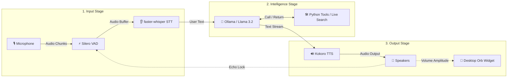

# Jarvis: Low-Latency Local Voice AI Assistant 🎙️🤖

[](#)
[](#)
[-blueviolet)](#)
[-orange)](#)
[-ff69b4)](#)
[](#)

**Jarvis** is a low-latency, local-first voice assistant that runs 100% on your machine. It features highly responsive Voice Activity Detection (VAD), fast Speech-to-Text (STT) transcription, local Language Model (LLM) orchestration with custom tool plugins (including real-time web search and stock lookups), fast Text-to-Speech (TTS) audio streaming, and a floating Siri-like desktop orb widget.

---

## ⚡ Quick Start (3 Steps)

### 1. System & Python Setup
```bash
# macOS (Homebrew)
brew install portaudio espeak-ng

# Install Python requirements
pip install -r requirements.txt
```

### 2. Pull Local Model (Ollama)
Make sure your local [Ollama](https://ollama.com/) instance is running, then pull the lightweight Llama 3.2 model:
```bash
ollama pull llama3.2
```

### 3. Launch Jarvis!
```bash
python main.py
```

---

## 📜 Changelog & Version History

- **2026-08-04**: Upgraded default Whisper model to `base.en` and introduced the `--stt-model` CLI parameter.
- **2026-08-04**: Implemented deterministic `get_relevant_tools` routing in `llm_engine.py` to eliminate tool calling hallucinations in Ollama/Llama 3.2.
- **2026-08-04**: Integrated real-time web search (`search_web`) via DuckDuckGo and Yahoo Finance stock lookups, plus live news streaming via Google News RSS (`get_latest_news`).
- **2026-08-04**: Added automatic web search routing for political leader queries (presidents, prime ministers, governors, mayors) and general question prompts.
- **2026-08-04**: Enhanced Desktop Orb UI with click-and-drag repositioning, macOS Cocoa background transparency fix, MPS/CUDA auto-acceleration for Kokoro TTS, and conversation memory buffer pruning.

---

## 🛠️ Architecture & Pipeline Flow

The system operates as an asynchronous pipeline designed to minimize latency and prevent acoustic echo feedback.

### How Data Flows (Step-by-Step)

1. **🎙️ Speech Capture & VAD**: Microphone audio is processed by **Silero VAD** for sub-millisecond edge endpointing to filter out background noise.
2. **👂 Speech-to-Text (STT)**: Speech buffers are transcribed asynchronously using **faster-whisper**.
3. **🧠 Intelligence & Tools**: **Ollama (Llama 3.2)** processes the prompt. If live web info, stocks, news, or weather are requested, Python tools execute and return results to the LLM.
4. **🔊 Text-to-Speech (TTS)**: Response text is chunked sentence-by-sentence into **Kokoro TTS**, which immediately streams synthesized audio to the speakers.
5. **🔮 Animation & Echo Lock**: Audio output drives real-time scaling on the **Desktop Orb Widget** while dynamically locking the mic to prevent self-transcription (echo gating).



---

## 🌟 Core Features

*   **⚡ Sub-100ms First-Syllable Latency**: Optimized using real-time audio chunk streaming, regex sentence punctuation chunking, Whisper VAD-bypass, and fine-tuned Ollama configurations.
*   **🔮 Siri-Like Desktop Orb**: A borderless, floating UI widget that breathes when listening, sways when thinking, and pulsates/scales dynamically in direct response to the speaker's volume (amplitude) when speaking. Click and drag to reposition anywhere on screen.
*   **🔒 Private & Local-First**: Core models (Silero VAD, Whisper STT, Llama LLM, Kokoro TTS) run completely locally on your hardware. Hardware acceleration (MPS for Apple Silicon, CUDA for NVIDIA GPUs) is auto-detected. Live web search is strictly transparent & opt-in.
*   **🔄 Configurable Barge-In (Full Duplex)**: Interrupt the assistant at any time while speaking. Supports `smart` (volume-gated amplitude threshold), `headphones` (fully duplex, open mic), and `disabled` (half-duplex mic lock) modes.
*   **🛡️ Echo & Loop Prevention**: Dynamic echo decay cooldown (`0.35s`) and amplitude thresholding prevent the assistant from hearing and transcribing its own speech output.
*   **🔧 Deterministic Tool Routing**: Local Python tools for checking weather, toggling smart lights, getting local time, searching Wikipedia, fetching breaking news, and searching the web. Conversational greetings are filtered to prevent false tool triggers.

---

## 🌐 Real-Time Web & Tool Integration

Jarvis deterministically invokes Python tools depending on user input:

| Capability | Example Prompt | Executed Tool | Source / API |
| :--- | :--- | :--- | :--- |
| **📈 Real-Time Stocks** | *"What is Tesla stock price?"* | `search_web` | Yahoo Finance API (`TSLA`, `AAPL`, `MSFT`, `GOOGL`, `AMZN`, `NVDA`, `META`, `NFLX`, `AMD`, `INTC`) |
| **🌐 Live Web Search** | *"Who won the game today?"* | `search_web` | DuckDuckGo Text Search API |
| **🏛️ Political Leaders** | *"Who is the prime minister of Canada?"* | `search_web` | Live Web Lookup |
| **📰 Global Breaking News** | *"What's the latest news?"* | `get_latest_news` | Google News RSS Feed |
| **📚 Fact Summaries** | *"Tell me about Quantum Computing"* | `search_wikipedia` | Wikipedia REST API |
| **☀️ Weather** | *"What's the weather in Tokyo?"* | `get_weather` | OpenWeather API |
| **💡 Smart Lights** | *"Turn off the living room lights"* | `toggle_smart_lights` | Smart Home REST API |
| **⏰ Local Time** | *"What time is it?"* | `get_current_time` | System Clock |

---

## 📁 Codebase Directory Breakdown

*   [main.py](main.py) - Orchestrator that initializes all modules and launches asynchronous worker loops concurrently.
*   [audio_engine.py](audio_engine.py) - Handles microphone input, runs Silero VAD, manages feedback/echo locks, and detects user speech onset.
*   [stt_engine.py](stt_engine.py) - Consumes speech buffers from the VAD queue and transcribes them asynchronously using `faster-whisper`.
*   [llm_engine.py](llm_engine.py) - Coordinates conversation memory, streams text sentence-by-sentence using punctuation matching, and handles tool calling with deterministic keyword routing.
*   [tts_engine.py](tts_engine.py) - Synthesizes spoken audio using Kokoro TTS (hardware-accelerated) and streams audio segments to the audio driver immediately with real-time amplitude calculation.
*   [ui_engine.py](ui_engine.py) - Tkinter-based floating desktop widget providing live, animated visual feedback with click-and-drag repositioning.
*   [test_jarvis.py](test_jarvis.py) - Automated unit test suite covering tool execution, memory pruning, and keyword triggers.
*   [Dockerfile](Dockerfile) - Container definition for Linux deployments exposing host audio devices.
*   [requirements.txt](requirements.txt) - Python dependency manifest.

---

## 🏎️ Core Latency & Technical Optimizations

*   **🎙️ Real-Time TTS Chunk Streaming**: Kokoro's pipeline generator runs in a background worker thread. Synthesized audio segments are immediately pushed to the main thread's audio playback queue via `loop.call_soon_threadsafe`, reducing startup latency to under **50ms**.
*   **🔄 Adaptive Echo-Gating (Smart Barge-In)**: Dynamic RMS amplitude calculation gates mic input only if user volume is lower than `max(0.08, speaker_amplitude * 1.5)`. Loud user speech instantly releases the lock for barge-in.
*   **🔇 Whisper VAD-Bypass**: By relying on primary Silero VAD endpoints for speech capture, redundant second-pass VAD filtering in `faster-whisper` (`vad_filter=False`) is disabled, saving **100–300ms** of transcription overhead.
*   **⏳ Aggressive Silence Endpointing**: Silence endpoint threshold set to `0.35s` (down from `1.2s`) and echo cooldown set to `0.35s` to start STT transcription instantly after user speech finishes.
*   **🎨 macOS Cocoa Transparency Fix**: Standard transparent canvases in macOS Cocoa composite transparent PNG alpha channels against the transparent background window. Resolved by drawing a solid white circular background (`canvas.create_oval`) behind the moving avatar matching its exact dynamic scale.
*   **♻️ Tkinter Garbage Collection Preservation**: Tkinter's C-bindings do not retain references to Python `PhotoImage` objects created dynamically during frame loops (30 FPS). Prevented by storing explicit references on the canvas (`self.canvas.image = self.avatar_img`) to bypass Python garbage collection sweeps.
*   **Greedy LLM Decoding**: Configured Ollama prompts with greedy decoding (`temperature: 0.0`), smaller context history window (`num_ctx: 1024`), and short prediction limits (`num_predict: 50`) to avoid context-loading overhead.

---

## 📦 System Requirements & Dependencies

### Hardware Requirements
*   **Disk Space**: ~4.5 GB to 7.2 GB (Whisper, Kokoro, and Ollama Llama 3.2 model storage).
*   **RAM**: 8 GB minimum (16 GB recommended for GPU acceleration).

### System Dependencies
*   **macOS (Homebrew)**:
    ```bash
    brew install portaudio espeak-ng
    ```
*   **Linux (Debian/Ubuntu)**:
    ```bash
    sudo apt-get install portaudio19-dev alsa-utils libasound2-dev espeak-ng
    ```

---

## 🚀 Running & Configuration Options

### Launch Assistant Modes:
*   **Smart Mode** (Default - volume-gated for speakers):
    ```bash
    python main.py
    ```
*   **Headphones Mode** (Recommended for headphones - full duplex, open mic):
    ```bash
    python main.py --barge-in headphones
    ```
*   **Disabled Mode** (Traditional mic lock while speaking):
    ```bash
    python main.py --barge-in disabled
    ```

### Customize STT Model:
Specify a different Whisper model (`tiny.en`, `base.en`, `small.en`, `medium.en`):
```bash
python main.py --stt-model small.en
```

### Standalone UI Testing:
Test desktop widget animation states independently:
```bash
python ui_engine.py
```

### Automated Unit Tests:
Run full unit test suite:
```bash
python -m unittest test_jarvis.py
```

### Docker Deployment (Linux)
Build and run the assistant container with host audio driver access:
```bash
docker build -t local-voice-ai .
docker run -it --device /dev/snd --network host local-voice-ai
```

---

## 📄 License

Distributed under the MIT License.
