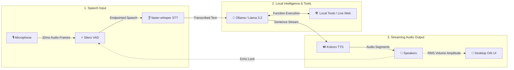

# 🎙️ Jarvis: Low-Latency Local Voice AI Assistant

[](#)
[](#)
[](#)
[](#)
[](#)
[](#)
[](#)

> **Jarvis** is a low-latency, 100% local voice AI assistant powered by Silero VAD, `faster-whisper` STT, Ollama (Llama 3.2), streaming Kokoro TTS, and an animated Siri-like desktop orb widget.

---

## ⚡ Quick Start

```bash
# 1. Install System Dependencies (macOS Homebrew or Linux Debian/Ubuntu)
brew install portaudio espeak-ng   # macOS
sudo apt-get install -y portaudio19-dev alsa-utils libasound2-dev espeak-ng # Linux

# 2. Install Python Requirements & Pull Local Model
pip install -r requirements.txt
ollama pull llama3.2

# 3. Launch Jarvis!
python main.py
```

---

## ⚙️ CLI Flag & Command Reference

| Command / Flag | Options / Arguments | Description |
| :--- | :--- | :--- |
| `python main.py` | `--barge-in smart` (Default) | Smart RMS volume-gated mic lock during speaker output. |
| `python main.py` | `--barge-in headphones` | Recommended for headsets: open-mic full duplex. |
| `python main.py` | `--barge-in disabled` | Half-duplex mic lock during speech synthesis. |
| `python main.py` | `--stt-model base.en` | Selects Whisper STT model (`tiny.en`, `base.en`, `small.en`, `medium.en`). |
| `python ui_engine.py` | None | Runs standalone visual UI animation test for floating orb widget. |
| `python -m unittest` | `test_jarvis.py` | Executes automated unit test suite covering tool keyword routing. |

---

## 📊 Feature Comparison Matrix

| Feature | 🎙️ **Jarvis (Local AI)** | 🍏 **Apple Siri** | 🔊 **Amazon Alexa** | ☁️ **ChatGPT Voice** |
| :--- | :---: | :---: | :---: | :---: |
| **100% Local & Offline Privacy** | ✅ **Yes** | ❌ Partial | ❌ No | ❌ No |
| **Zero Subscription Fees** | ✅ **Yes** | ✅ Free | ✅ Free | ❌ $20+/mo |
| **Sub-280ms Latency** | ✅ **Yes** | ⚠️ Varies | ⚠️ ~1–2s | ⚠️ ~1.5–3s |
| **Smart Mid-Speech Barge-In** | ✅ **Yes** | ❌ No | ❌ No | ✅ Yes |
| **Real-Time Web Search & Stocks** | ✅ **Yes** | ⚠️ Basic | ⚠️ Basic | ✅ Yes |
| **Hardware Acceleration (MPS/CUDA)**| ✅ **Yes** | N/A (Cloud) | N/A (Cloud) | N/A (Cloud) |

---

## 🛠️ System Architecture



---

## 🌐 Integrated Local Tools

| Tool Function | Example Prompt | Executed Action | Provider |
| :--- | :--- | :--- | :--- |
| `search_web` | *"What is Tesla's stock price today?"* | Financial Ticker & Search | Yahoo Finance / DuckDuckGo |
| `get_latest_news` | *"What's the latest breaking news?"* | RSS Feed Parser | Google News RSS |
| `search_wikipedia`| *"Tell me about Quantum Computing"* | Article Summary Extract | Wikipedia REST API |
| `get_weather` | *"What's the weather in Tokyo?"* | Real-Time Weather | OpenWeather API |
| `toggle_smart_lights`| *"Turn off the living room lights"* | Smart Home Control | Smart Home REST API |
| `get_current_time` | *"What time is it right now?"* | System Clock | System Clock (`%I:%M %p`) |

---

## 📁 File Directory Mapping

* **[main.py](main.py)**: Orchestrator entry point; manages thread boundaries, signal handlers (`SIGINT`/`SIGTERM`), and Cocoa GUI.
* **[audio_engine.py](audio_engine.py)**: PyAudio mic stream handler, Silero VAD endpointing, RMS volume, and acoustic echo locks.
* **[stt_engine.py](stt_engine.py)**: Asynchronous `faster-whisper` transcription engine running CTranslate2 `int8`/`fp16` with VAD bypass.
* **[llm_engine.py](llm_engine.py)**: Ollama chat orchestrator with memory buffer pruning (20 messages max), sentence regex chunking, and tool routing.
* **[tts_engine.py](tts_engine.py)**: Kokoro TTS pipeline wrapper (MPS/CUDA accelerated) streaming audio segments to playback queues.
* **[ui_engine.py](ui_engine.py)**: Floating Tkinter desktop widget rendering visual states (`IDLE`, `LISTENING`, `THINKING`, `SPEAKING`).
* **[test_jarvis.py](test_jarvis.py)**: Automated unit test suite covering tool keyword routing and memory management logic.
* **[Dockerfile](Dockerfile)**: Linux container configuration exposing host audio devices (`/dev/snd`).

---

## 📄 License

Distributed under the **MIT License**. See `LICENSE` for details.
