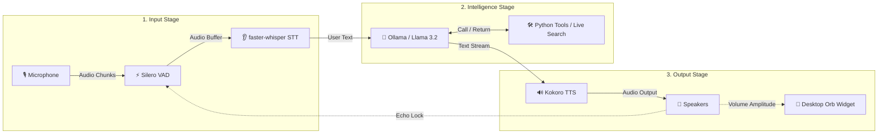

# Jarvis: Low-Latency Local Voice AI Assistant 🎙️🤖

[](#)
[](#)
[-blueviolet)](#)
[-orange)](#)
[-ff69b4)](#)
[](#)

Jarvis is a low-latency, local-first voice assistant that runs on your machine. It features highly responsive Voice Activity Detection (VAD), fast Speech-to-Text (STT) transcription, local Language Model (LLM) orchestration with custom tool calling (including real-time web search), real-time Text-to-Speech (TTS) audio streaming, and a gorgeous, Siri-like floating desktop widget that reacts in real-time.

---

## 📜 Changelog

- **2026-08-04**: Upgraded Whisper STT model default to `base.en` and introduced the `--stt-model` CLI parameter.
- **2026-08-04**: Implemented deterministic `get_relevant_tools` routing to prevent Ollama/Llama 3.2 tool call hallucinations.
- **2026-08-04**: Integrated real-time web search (`search_web`) using DuckDuckGo and Yahoo Finance (for real-time stock lookups), plus live news streaming via Google News RSS (`get_latest_news`).
- **2026-08-04**: Added automatic web search routing for political leader queries (presidents, prime ministers, governors, mayors).
- **2026-08-04**: Enhanced Desktop Orb UI with click-and-drag re-positioning, MPS/CUDA auto-acceleration for Kokoro TTS, and conversation history memory pruning.

---

## 🛠️ Architecture & Pipeline Flow

Jarvis uses a high-performance, asynchronous pipeline engineered for low latency and smart echo prevention.

### How Data Flows (Step-by-Step)

1. **🎙️ Speech Capture**: Microphone raw audio is processed by **Silero VAD** to detect speech boundaries and filter out silence.
2. **👂 Speech-to-Text (STT)**: Endpointed speech buffers are transcribed into text using **faster-whisper**.
3. **🧠 Intelligence & Tools**: **Ollama (Llama 3.2)** processes the prompt. If real-time info is needed (stocks, news, weather, web search), Python tools execute and return data to the LLM.
4. **🔊 Text-to-Speech (TTS)**: Response text is streamed sentence-by-sentence to **Kokoro TTS** for immediate audio generation.
5. **🔮 Animation & Echo Lock**: Audio output drives real-time scaling on the **Desktop Orb Widget** while dynamically locking the mic to prevent acoustic echo feedback.



---

## 🌟 Core Features

*   **⚡ Sub-100ms First-Syllable Latency**: Optimized using real-time audio chunk streaming, sentence punctuation chunking, Whisper VAD-bypass, and fine-tuned Ollama configurations.
*   **🔮 Siri-Like Desktop Orb**: A borderless, floating UI widget that breathes when listening, sways when thinking, and pulsates/scales dynamically in direct response to the speaker's volume (amplitude) when speaking. Click and drag to reposition anywhere on your desktop.
*   **🔒 Private & Local-First**: Core models (Silero VAD, Whisper STT, Llama LLM, Kokoro TTS) run completely locally on your hardware. Hardware acceleration (MPS for Apple Silicon, CUDA for NVIDIA GPUs) is auto-detected. Live web search is strictly transparent & opt-in.
*   **🔄 Configurable Barge-In (Full Duplex)**: Interrupt the assistant at any time. Supports `smart` (volume-gated amplitude threshold), `headphones` (fully duplex, open mic), and `disabled` (half-duplex lock) modes.
*   **🛡️ Echo & Loop Prevention**: Dynamic echo decay cooldown and amplitude thresholding prevent the assistant from hearing and transcribing its own speech output.
*   **🔧 Plugin System & Deterministic Routing**: Local Python tools for checking weather, toggling smart lights, getting local time, searching Wikipedia, fetching breaking news, and searching the web. Conversational greetings are filtered to prevent false tool triggers.

---

## 📁 Codebase Directory Breakdown

*   [main.py](main.py) - Orchestrator that initializes all modules and launches asynchronous worker loops concurrently.
*   [audio_engine.py](audio_engine.py) - Handles microphone input, runs Silero VAD, manages feedback/echo locks, and detects user speech onset.
*   [stt_engine.py](stt_engine.py) - Consumes speech buffers from the VAD queue and transcribes them asynchronously using `faster-whisper`.
*   [llm_engine.py](llm_engine.py) - Coordinates conversation memory, streams text sentence-by-sentence using punctuation matching, and handles tool calling with deterministic keyword routing.
*   [tts_engine.py](tts_engine.py) - Synthesizes spoken audio using Kokoro TTS (hardware-accelerated) and streams audio segments to the audio driver immediately with real-time amplitude calculation.
*   [ui_engine.py](ui_engine.py) - Tkinter-based floating desktop widget providing live, animated visual feedback with click-and-drag repositioning.
*   [test_jarvis.py](test_jarvis.py) - Automated unit test suite covering tool execution, memory pruning, and keyword triggers.
*   [Dockerfile](Dockerfile) - Container definition for Linux deployments exposing host audio devices.
*   [requirements.txt](requirements.txt) - Python dependency manifest.

---

## 🌐 Real-Time Web & Tool Integration

Jarvis intelligently invokes python tools depending on the user query:

1.  **Web Search (`search_web`)**:
    *   **Stock Lookups**: Fetches real-time market prices from Yahoo Finance for major tickers (`TSLA`, `AAPL`, `MSFT`, `GOOGL`, `AMZN`, `NVDA`, `META`, `NFLX`, `AMD`, `INTC`).
    *   **DuckDuckGo Search**: Retrieves live context and search summaries for real-time topics, current events, or general questions.
    *   **Political Leader Queries**: Automatically triggers web search for queries involving titles like *president*, *prime minister*, *governor*, *mayor*, or *chancellor*.
    *   **Question Fallback**: Any query containing a question mark (`?`) or starting with question words (*who*, *what*, *where*, *when*, *why*, *how*, *which*, *whom*) triggers web lookup.
2.  **Live News (`get_latest_news`)**: Fetches top global headlines from Google News RSS feed.
3.  **Fact Lookups (`search_wikipedia`)**: Searches Wikipedia articles for structured historical or factual summaries.
4.  **Local Smart Home & Utility Tools**: `get_weather`, `toggle_smart_lights`, and `get_current_time`.

---

## 📈 Recent Improvements

- **Deterministic Tool Routing**: Replaced naive tool gating with `get_relevant_tools` in `llm_engine.py` to expose only necessary function schemas per prompt, eliminating LLM tool hallucinations.
- **Enhanced STT Accuracy**: Default Whisper model upgraded to `base.en`, with CLI flag (`--stt-model`) for selecting larger models (`small.en`, `medium.en`).
- **Live Web Search & Stock Tickers**: Added Yahoo Finance market data and DuckDuckGo integration, with special handling for political leader lookups.
- **Robust Argument Parsing**: Added type checking inside `search_web` to handle dictionary arguments generated by LLM tool calls gracefully.
- **Memory & Latency Safeguards**: Added conversation history memory pruning (capped to 20 messages) and sentence-level regex punctuation chunking for instantaneous TTS streaming.

---

## 🏎️ Latency & Technical Optimizations

*   **🎙️ Real-Time TTS Chunk Streaming**: Kokoro's pipeline generator is executed in a background worker thread. Synthesized audio segments are immediately pushed to the main thread's audio playback queue via `loop.call_soon_threadsafe`, achieving first-syllable latency under **50ms**.
*   **🔄 Adaptive Echo-Gating (Smart Barge-In)**: Dynamic RMS amplitude calculation gates mic input only if user volume is lower than `max(0.08, speaker_amplitude * 1.5)`. Loud user speech instantly releases the lock for barge-in.
*   **🔇 Whisper VAD-Bypass**: By relying on primary Silero VAD endpoints, redundant second-pass VAD filtering in `faster-whisper` (`vad_filter=False`) is disabled, saving **100–300ms** of transcription overhead.
*   **⏳ Aggressive Endpointing**: Silence endpoint threshold set to `0.35s` (down from `1.2s`) and echo cooldown set to `0.35s` for instant response generation.
*   **🎨 macOS Cocoa Transparency**: Drawn solid white circular background behind moving avatar matching dynamic scale to fix Cocoa PNG alpha compositing issues.
*   **♻️ Tkinter Garbage Collection Preservation**: Retains explicit canvas references (`self.canvas.image = self.avatar_img`) during 30 FPS rendering loops to prevent dynamic memory garbage collection glitches.
*   **Greedy LLM Decoding**: Configured Ollama prompts with `temperature: 0.0`, `num_ctx: 1024`, and short prediction limits.

---

## 📦 Requirements & Installation

### Hardware Requirements
*   **Disk Space**: ~4.5 GB to 7.2 GB (Whisper, Kokoro, and Ollama Llama 3.2 model storage).
*   **RAM**: 8 GB minimum (16 GB recommended for GPU acceleration).

### System Dependencies
Install PortAudio and system text-to-speech libraries:
*   **macOS (Homebrew)**:
    ```bash
    brew install portaudio espeak-ng
    ```
*   **Linux (Debian/Ubuntu)**:
    ```bash
    sudo apt-get install portaudio19-dev alsa-utils libasound2-dev espeak-ng
    ```

### Installation Steps

1.  **Install Python Dependencies**:
    ```bash
    pip install -r requirements.txt
    ```
2.  **Start Ollama Server & Pull Model**:
    ```bash
    ollama pull llama3.2
    ```

---

## 🚀 Running the Application

### Launch Jarvis Voice Assistant:
*   **Smart Mode** (Default - recommended for speakers):
    ```bash
    python main.py
    ```
*   **Headphones Mode** (Recommended for headphones - full duplex, open mic):
    ```bash
    python main.py --barge-in headphones
    ```
*   **Disabled Mode** (Traditional mic lock while speaking):
    ```bash
    python main.py --barge-in disabled
    ```

### Customize STT Model:
Specify a different Whisper model (`tiny.en`, `base.en`, `small.en`, `medium.en`):
```bash
python main.py --stt-model small.en
```

### Standalone UI Testing:
Test desktop widget animation states independently:
```bash
python ui_engine.py
```

### Automated Unit Tests:
Run full unit test suite:
```bash
python -m unittest test_jarvis.py
```

### Docker Deployment (Linux)
Build and run the assistant container with host audio driver access:
```bash
docker build -t local-voice-ai .
docker run -it --device /dev/snd --network host local-voice-ai
```
