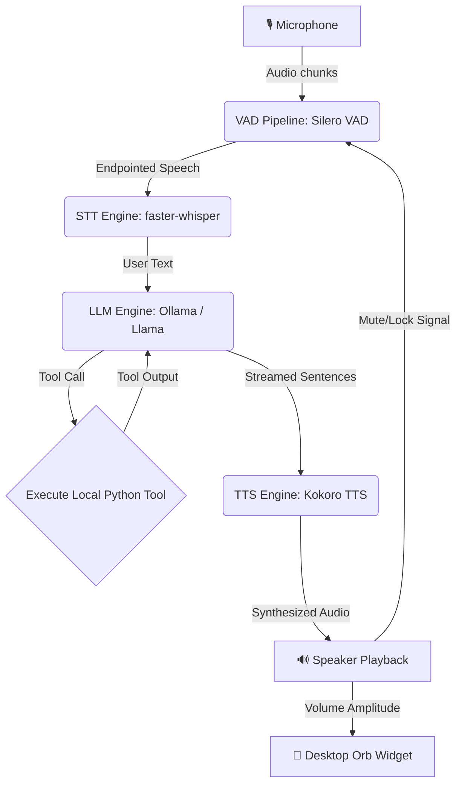

# Jarvis: Low-Latency Local Voice AI Assistant 🎙️🤖

[](#)
[](#)
[-blueviolet)](#)
[-orange)](#)
[-ff69b4)](#)
[](#)

Jarvis is a low-latency, fully offline, local voice assistant that runs entirely on your machine. It features highly responsive Voice Activity Detection (VAD), fast Speech-to-Text (STT) transcription, Language Model (LLM) orchestration with custom tool calling, real-time Text-to-Speech (TTS) audio streaming, and a gorgeous, Siri-like floating desktop widget that reacts in real-time.

---

## 🛠️ Architecture & Pipeline Flow

The system operates as an asynchronous, half-duplex voice pipeline designed to prevent acoustic echo feedback and maximize real-time streaming performance.



---

## 🌟 Core Features

*   **⚡ Sub-100ms First-Syllable Latency**: Optimized using real-time audio chunk streaming, Whisper VAD-bypass, and fine-tuned Ollama configurations.
*   **🔮 Siri-Like Desktop Orb**: A borderless, floating UI widget that breathes when listening, sways when thinking, and pulsates/scales dynamically in direct response to the speaker's volume (amplitude) when speaking.
*   **🔒 100% Offline & Private**: All models (Silero VAD, Whisper STT, Llama LLM, Kokoro TTS) run completely locally on your hardware.
*   **🔄 Smart Barge-In**: Press `Enter` in the console or just speak over the assistant; the pipeline instantly cancels current synthesis playback and switches back to listening.
*   **🛡️ Echo & Loop Prevention**: Built-in Half-Duplex lock and dynamic echo decay cooldown to prevent the assistant from hearing and transcribing its own speakers.
*   **🔧 Local Tool Plugins**: Built-in support for Python function execution (e.g. checking local time, fetching weather info, and toggling smart lights).

---

## 📁 Codebase Directory Breakdown

*   [main.py](file:///Users/saikrishnaallam/Desktop/jarvis_ai/main.py) - The orchestrator that initializes all modules and launches asynchronous worker loops concurrently.
*   [audio_engine.py](file:///Users/saikrishnaallam/Desktop/jarvis_ai/audio_engine.py) - Handles microphone input, runs Silero VAD, manages the feedback/echo locks, and detects user speech onset.
*   [stt_engine.py](file:///Users/saikrishnaallam/Desktop/jarvis_ai/stt_engine.py) - Consumes speech buffers from the VAD queue and transcribes them asynchronously using `faster-whisper`.
*   [llm_engine.py](file:///Users/saikrishnaallam/Desktop/jarvis_ai/llm_engine.py) - Asynchronously coordinates conversation history, streams text responses sentence-by-sentence, and manages local tool calling.
*   [tts_engine.py](file:///Users/saikrishnaallam/Desktop/jarvis_ai/tts_engine.py) - Synthesizes spoken audio using Kokoro TTS and streams audio segments to the audio driver immediately as they are generated.
*   [ui_engine.py](file:///Users/saikrishnaallam/Desktop/jarvis_ai/ui_engine.py) - A Tkinter-based floating desktop widget providing live, animated visual feedback of the assistant's internal state.

---

## 🏎️ Core Latency & UX Optimizations

We implemented several key refinements to ensure the voice agent is highly conversational and fluid:
1.  **Audio Streaming**: Synthesis is streamed clause-by-clause using background threads, meaning the speaker starts playing the beginning of a sentence before the end of the sentence has finished synthesizing.
2.  **Whisper VAD-Bypass**: By relying strictly on our primary Silero VAD endpoints, we bypassed redundant secondary VAD filtration in `faster-whisper`, shaving off `100-300ms` per turn.
3.  **Low VAD Endpointing Threshold**: Reduced silence endpointing detection to `0.35s` (down from `1.2s`) to start transcription almost instantly when you finish speaking.
4.  **Greedy LLM Decoding**: Configured Ollama requests to use greedy decoding (`temperature: 0.0`), a smaller context history window (`num_ctx: 1024`), and short predict bounds to minimize context load latency.
5.  **Cocoa Compositing Fix**: Added a solid white canvas compositor behind the circular PNG avatar to resolve macOS-specific transparency rendering bugs that make transparent PNGs invisible on transparent Tkinter canvases.

---

## 📦 Requirements & Local Installation

### Hardware Requirements
*   **Disk Space**: ~4.5 GB to 7.2 GB (Whisper, Kokoro, and Ollama Llama 3.2 model storage).
*   **RAM**: 8 GB minimum (16 GB recommended for GPU acceleration).

### System Dependencies
Ensure you have the PortAudio and system text-to-speech libraries installed:
*   **macOS (Homebrew)**:
    ```bash
    brew install portaudio espeak-ng
    ```
*   **Linux (Debian/Ubuntu)**:
    ```bash
    sudo apt-get install portaudio19-dev alsa-utils libasound2-dev espeak-ng
    ```

### Installation Steps

1.  **Install Python Packages**:
    ```bash
    pip install -r requirements.txt
    ```
2.  **Start Ollama Server**: Make sure your local [Ollama](https://ollama.com/) instance is running and pull the lightweight Llama 3.2 model:
    ```bash
    ollama pull llama3.2
    ```

---

## 🚀 Running the Application

### Start the full Assistant:
```bash
python main.py
```

### Standalone UI Testing:
To test the floating desktop widget in isolation (which cycles through visual states and tests the dynamic avatar scaling), run:
```bash
python ui_engine.py
```

### Running Unit Tests:
To run the automated unittest suite (which tests custom tools, Wikipedia search integration, memory pruning, VAD modes, and system formats), run:
```bash
python -m unittest test_jarvis.py
```

### Docker Deployment (Linux only)
To build and run the assistant container, exposing your audio hardware driver:
```bash
docker build -t local-voice-ai .
docker run -it --device /dev/snd --network host local-voice-ai
```
