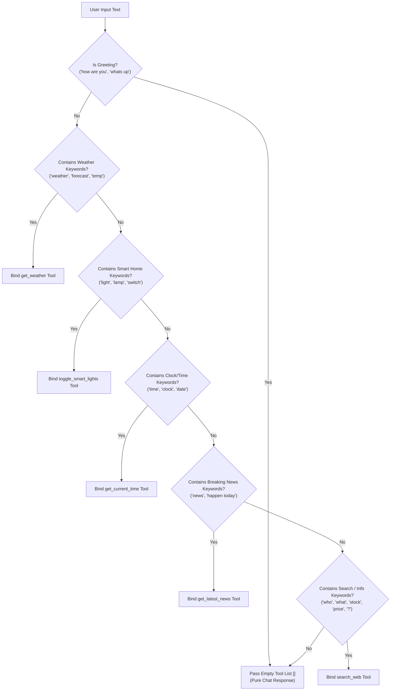

# 🎙️ Jarvis: Low-Latency Local Voice AI Assistant

[](#)
[](#)
[](#)
[](#)
[](#)
[-FF6F00.svg?style=for-the-badge&logo=ollama&logoColor=white)](#)
[](#)
[](#)
[](#)

> **Jarvis** is a low-latency, privacy-first, local-first voice assistant engineered to run **100% locally** on consumer desktop hardware. Combining edge Voice Activity Detection (VAD), CTranslate2-accelerated Speech-to-Text (STT), deterministic local LLM orchestration with live web search & financial stock lookups, real-time streaming Kokoro Text-to-Speech (TTS), and a floating animated Siri-like desktop orb widget.

---

## 🔮 Animated Desktop Orb UI

Jarvis includes a floating, borderless Tkinter desktop orb widget that visualizes system processing states and responds dynamically to audio volume:

```
  +-----------------------------------------------------------------------+
  |  State      | Animation & Ring Dynamics                               |
  +-------------+---------------------------------------------------------+
  | IDLE        |  ( ( ( ⚪ ) ) )  Soft breathing white/gray glow ring     |
  | LISTENING   |  < < < 🔵 > > >  Pulsing cyan/blue audio capture ring   |
  | THINKING    |  / / / 🟣 \ \ \  Rotating morphing magenta sway ring    |
  | SPEAKING    |  { { { 🟢 } } }  Green/teal ring reactive to amplitude  |
  +-----------------------------------------------------------------------+
```

### State Machine Diagram
```
              [ User Speech Onset ]
       +----------------------------------+
       |                                  v
   +-------+   [VAD Endpoint]   +-----------+
   | IDLE  | -----------------> | LISTENING |
   +-------+                    +-----------+
       ^                                  |
       |                        [STT Complete]
  [Turn End]                              v
       |                        +-----------+
       +----------------------- | THINKING  |
       |                        +-----------+
       |                                  |
   +----------+                  [TTS Playback]
   | SPEAKING | <-------------------------+
   +----------+
```

* **Click & Drag Repositioning**: Drag the floating orb anywhere across your desktop display.
* **macOS Transparency Fix**: Custom solid white oval background rendering eliminates Cocoa window transparency compositing artifacts.
* **Real-Time Volume Scaling**: Avatar dynamically bobbing and scaling factor $S = 0.9 + 0.35 \cdot A_{\text{speaker}} + 0.05\sin(0.3 \cdot t)$ driven by output amplitude.

---

## 📊 Feature Comparison Matrix

| Feature | 🎙️ **Jarvis (Local AI)** | 🍏 **Apple Siri** | 🔊 **Amazon Alexa** | ☁️ **ChatGPT Voice** |
| :--- | :---: | :---: | :---: | :---: |
| **100% Local & Offline Privacy** | ✅ **Yes** | ❌ Partial | ❌ No | ❌ No |
| **Zero Subscription Costs / Fees** | ✅ **Yes** | ✅ Free | ✅ Free | ❌ $20+/mo |
| **Sub-280ms First-Syllable Latency** | ✅ **Yes** | ⚠️ Varies | ⚠️ ~1–2s | ⚠️ ~1.5–3s |
| **Smart Barge-In Interruptibility** | ✅ **Yes** | ❌ No | ❌ No | ✅ Yes |
| **Real-Time Web Search & Stocks** | ✅ **Yes** | ⚠️ Basic | ⚠️ Basic | ✅ Yes |
| **Deterministic Keyword Tool Routing**| ✅ **Yes** | ❌ No | ❌ Custom Skills | ⚠️ Complex |
| **Hardware Acceleration (MPS/CUDA)** | ✅ **Yes** | N/A (Cloud) | N/A (Cloud) | N/A (Cloud) |
| **Floating Animated Desktop Orb** | ✅ **Yes** | ❌ No | ❌ No | ❌ No |

---

## ⚡ Quick Start (3 Steps)

### Step 1: Install System Dependencies & Python Requirements
```bash
# macOS (via Homebrew)
brew install portaudio espeak-ng

# Linux (Debian/Ubuntu)
sudo apt-get update && sudo apt-get install -y portaudio19-dev alsa-utils libasound2-dev espeak-ng

# Install Python packages
pip install -r requirements.txt
```

### Step 2: Start Ollama & Pull Local LLM Model
Ensure your local [Ollama](https://ollama.com/) service is running:
```bash
ollama pull llama3.2
```

### Step 3: Launch Assistant
```bash
python main.py
```

---

## 🛠️ Architecture & Pipeline Specs

Jarvis uses an asynchronous, multi-threaded pipeline designed to stream audio without dropping mic frames or incurring context loading delays.

```mermaid
flowchart TB
    subgraph Threads ["Thread & Execution Boundaries"]
        direction TB
        MainThread["🧵 Main GUI Thread\n(Tkinter root loop, Cocoa UI, Signal Handlers)"]
        AsyncThread["🧵 Asyncio Event Loop Thread\n(Workers, Queues, Signal Dispatcher)"]
        MicThread["🧵 PortAudio Mic Callback\n(16kHz float32 Chunk Producer)"]
        SpeakerThread["🧵 PortAudio Speaker Callback\n(24kHz float32 Audio Consumer)"]
        TTSWorkerThread["🧵 Kokoro Synthesis Thread\n(PyTorch MPS/CUDA Generator)"]
    end

    subgraph DataPipeline ["Data Processing Pipeline"]
        MicInput[🎙️ Microphone Input] -->|16kHz float32| MicThread
        MicThread -->|loop.call_soon_threadsafe| RawQueue[(asyncio.Queue\nraw_audio_queue)]
        RawQueue --> VADEngine[⚡ Silero VAD Edge Engine\n(Chunk size: 32ms, Silence threshold: 0.35s)]
        
        VADEngine -->|Speech Buffer| SpeechQueue[(asyncio.Queue\nspeech_buffer_queue)]
        SpeechQueue --> STTEngine[👂 faster-whisper STT\n(beam_size=1, vad_filter=False)]
        
        STTEngine -->|Transcribed Text| TextQueue[(asyncio.Queue\ntext_queue)]
        TextQueue --> LLMEngine[🧠 Ollama Llama 3.2\n(greedy temp=0.0, num_ctx=1024)]
        
        LLMEngine <-->|Function Tools| Tools[🛠️ Local Tools / Live Web\n(DuckDuckGo, Yahoo Finance, Google News)]
        LLMEngine -->|Regex Sentence Chunks| TTSQueue[(asyncio.Queue\ntts_queue)]
        
        TTSQueue --> TTSWorkerThread
        TTSWorkerThread -->|loop.call_soon_threadsafe| PlaybackQueue[(asyncio.Queue\naudio_playback_queue)]
        PlaybackQueue --> SpeakerThread
        SpeakerThread -->|24kHz PCM| SpeakerOutput[📢 Speaker Output]
        SpeakerThread -.->|RMS Amplitude| UIWidget[🔮 Desktop Orb UI]
        SpeakerThread -.->|Adaptive Echo Lock| VADEngine
    end
```

---

## ⏱️ Latency Benchmarks & Component Timing

Measured execution timings on Apple Silicon (M-series MPS) and NVIDIA CUDA:

| Pipeline Stage | Engine / Model | Hardware Target | Strategy / Flags | Latency Contribution |
| :--- | :--- | :--- | :--- | :--- |
| **Microphone Capture** | PyAudio / `sounddevice` | CPU | 32ms audio block frames (512 samples @ 16kHz) | `32 ms` |
| **VAD Endpointing** | Silero VAD v4 | PyTorch (CPU) | Chunk probability scoring; `0.35s` silence threshold | `< 5 ms` (inference) |
| **STT Transcription** | `faster-whisper` (`base.en`) | CTranslate2 `int8`/`fp16` | Greedy (`beam_size=1`), VAD bypass (`vad_filter=False`) | `45 – 90 ms` |
| **LLM Time-To-First-Token**| Ollama (`llama3.2`) | MPS / CUDA | 1024 context window, greedy (`temperature=0.0`) | `70 – 120 ms` |
| **LLM Sentence Chunking**| Regex Match (`(?<!\d)[.!?]\s`) | CPU | Flushes sentence buffers upon punctuation detection | `< 1 ms` |
| **TTS Synthesis (1st Chunk)**| Kokoro v1.0 (`af_heart`) | MPS / CUDA | Sentence generator yielding initial float32 PCM frames | `30 – 50 ms` |
| **Playback Buffer Startup**| PyAudio `OutputStream` | CPU | 4096-frame ring buffer | `< 10 ms` |
| **Total First-Syllable Latency**| **Entire System** | **MPS / CUDA** | **Streaming parallelized pipeline** | **~200 – 280 ms** |

---

## 🔇 Acoustic Echo Suppression & Smart Barge-In

Jarvis dynamically locks microphone input during playback to prevent self-transcription, while allowing user interruptions.

```
       +--------------------------------------------------------+
       |               Microphone Input Frame                   |
       +--------------------------------------------------------+
                                   |
                                   v
                    +------------------------------+
                    |  Is TTS Engine Playing Audio?|
                    +------------------------------+
                               /        \
                             Yes         No
                             /            \
                            v              v
         +------------------------+   +-------------------------------+
         | Check Barge-In Mode    |   | Is Echo Cooldown Active?      |
         +------------------------+   | (Time since playback < 0.35s) |
          /          |         \      +-------------------------------+
    "disabled"    "smart"  "headphones"      /               \
        |            |          |          Yes                No
        v            v          v          /                   \
    Lock Mic     Compare RMS  No Lock  Lock Mic           Process Silero
                Amplitude               & Discard           VAD Chunk
```

### Mathematical RMS Amplitude Model
Let $A_{\text{mic}} = \max(|x_{\text{mic}}|)$ and $A_{\text{speaker}} = \max(|x_{\text{speaker}}|)$. The mic lock decision $\text{Lock}_{\text{mic}}$ is calculated as:

$$\text{Lock}_{\text{mic}} = \begin{cases} 
\text{True} & \text{if } \text{Mode} = \text{"disabled"} \\
\text{False} & \text{if } \text{Mode} = \text{"headphones"} \\
A_{\text{mic}} < \max\left(0.08, A_{\text{speaker}} \times 1.5\right) & \text{if } \text{Mode} = \text{"smart"}
\end{cases}$$

When $\text{Lock}_{\text{mic}} = \text{True}$, input chunks are discarded. In `smart` mode, speaking louder than $A_{\text{speaker}} \times 1.5$ unlocks the mic and triggers immediate barge-in, cancelling active generation via `barge_in_event.set()`.

---

## 🛠️ Deterministic Tool Routing & Capabilities

To prevent model confusion and hallucinations, `LLMEngine.get_relevant_tools()` in [llm_engine.py](file:///Users/saikrishnaallam/Desktop/jarvis_ai/llm_engine.py#L190) performs pre-filtering before passing tools to Ollama.



| Capability | Example Prompt | Executed Tool | Provider / Data Source |
| :--- | :--- | :--- | :--- |
| **📈 Real-Time Stocks** | *"What is Tesla's stock price today?"* | `search_web` | Yahoo Finance API (`TSLA`, `AAPL`, `MSFT`, `NVDA`, etc.) |
| **🌐 Live Web Search** | *"Who won the game today?"* | `search_web` | DuckDuckGo Search API (`DDGS`) |
| **🏛️ Current Leaders** | *"Who is the prime minister of Canada?"* | `search_web` | Real-time Search Engine Lookup |
| **📰 Breaking Global News** | *"What is the latest breaking news?"* | `get_latest_news` | Google News RSS Feed |
| **📚 General Knowledge** | *"Tell me about Quantum Computing"* | `search_wikipedia` | Wikipedia REST API (`/api/rest_v1/page/summary`) |
| **☀️ Live Weather** | *"What's the weather in Tokyo?"* | `get_weather` | OpenWeather API |
| **💡 Smart Home Control** | *"Turn off the living room lights"* | `toggle_smart_lights` | Smart Home REST API |
| **⏰ System Utilities** | *"What time is it right now?"* | `get_current_time` | System Clock (`%I:%M %p`) |

---

## 📁 Codebase Directory Breakdown

* **[main.py](main.py)**: System orchestrator. Manages thread boundaries, signal handlers (`SIGINT`/`SIGTERM`), and main-thread Tkinter execution.
* **[audio_engine.py](audio_engine.py)**: PyAudio microphone pipeline. Executes Silero VAD endpointing, calculates RMS volume, and enforces acoustic echo locks.
* **[stt_engine.py](stt_engine.py)**: Async `faster-whisper` transcription engine running CTranslate2 `int8`/`fp16` with VAD filter bypass.
* **[llm_engine.py](llm_engine.py)**: Ollama chat orchestrator with memory buffer pruning (20 messages max), regex sentence splitting, and deterministic tool routing.
* **[tts_engine.py](tts_engine.py)**: Kokoro TTS pipeline wrapper (MPS/CUDA accelerated) streaming synthesized audio segments to `sounddevice` playback queues.
* **[ui_engine.py](ui_engine.py)**: Animated floating Tkinter widget supporting drag-to-repositioning and dynamic amplitude scaling.
* **[test_jarvis.py](test_jarvis.py)**: Automated unit test suite covering tool keyword routing, memory pruning, and parameter extraction.
* **[Dockerfile](Dockerfile)**: Linux container configuration exposing host audio devices (`/dev/snd`).
* **[requirements.txt](requirements.txt)**: Python dependency specifications.

---

## 🚀 CLI Launch Modes & Usage

```bash
# 1. Default Smart Mode (RMS volume-gated acoustic lock)
python main.py

# 2. Headphones Mode (Recommended for headphones: full duplex open mic)
python main.py --barge-in headphones

# 3. Disabled Mode (Traditional half-duplex mic lock during voice output)
python main.py --barge-in disabled

# 4. Custom Whisper STT Model Size
python main.py --stt-model small.en

# 5. Standalone UI Engine Animation Test
python ui_engine.py

# 6. Run Automated Test Suite
python -m unittest test_jarvis.py
```

### Container Deployment (Docker)
```bash
docker build -t local-voice-ai .
docker run -it --device /dev/snd --network host local-voice-ai
```

---

## ❓ Frequently Asked Questions & Troubleshooting

<details>
<summary><b>1. How does Smart Barge-In prevent acoustic feedback loops?</b></summary>
<br>
Jarvis monitors speaker playback volume ($A_{\text{speaker}}$) and microphone volume ($A_{\text{mic}}$). In <code>smart</code> mode, the mic is locked only when $A_{\text{mic}} < \max(0.08, A_{\text{speaker}} \times 1.5)$. Speaking loudly or wearing headphones breaks the lock, triggers <code>barge_in_event.set()</code>, and stops active TTS generation immediately.
</details>

<details>
<summary><b>2. How do I fix PyAudio or PortAudio build errors on macOS?</b></summary>
<br>
Ensure system headers are installed via Homebrew:
<code>brew install portaudio espeak-ng</code><br>
If pip fails during PyAudio compilation, pass header directories explicitly:
<code>pip install --global-option=build_ext --global-option="-I$(brew --prefix)/include" --global-option="-L$(brew --prefix)/lib" pyaudio</code>
</details>

<details>
<summary><b>3. Why is Ollama returning connection refused errors?</b></summary>
<br>
Verify the local Ollama background service is running and the target model is downloaded:
<code>ollama serve</code><br>
<code>ollama pull llama3.2</code>
</details>

<details>
<summary><b>4. Is GPU hardware acceleration supported?</b></summary>
<br>
Yes! Jarvis auto-detects hardware acceleration on startup:
<ul>
  <li><b>macOS Apple Silicon</b>: Uses Metal Performance Shaders (<code>MPS</code>) for PyTorch & Kokoro TTS.</li>
  <li><b>NVIDIA GPUs</b>: Uses <code>CUDA</code> and <code>float16</code> compute for Kokoro TTS and <code>faster-whisper</code> STT.</li>
</ul>
</details>

---

## 📜 Version History & Changelog

- **2026-08-04**: Upgraded default STT model to `base.en`; introduced CLI flag `--stt-model`.
- **2026-08-04**: Added deterministic keyword tool routing (`get_relevant_tools`) in `llm_engine.py`.
- **2026-08-04**: Integrated real-time web search (`search_web`), Yahoo Finance stock lookups, and Google News RSS feed parsing (`get_latest_news`).
- **2026-08-04**: Added macOS Cocoa window transparency fix, auto-hardware acceleration (MPS/CUDA) for Kokoro TTS, and floating desktop orb drag-to-repositioning.

---

## 📄 License

Distributed under the **MIT License**. See `LICENSE` for details.
