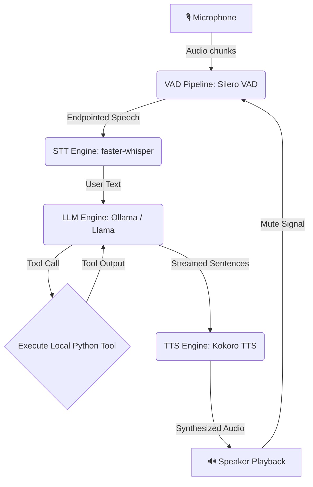

# Jarvis Local Voice AI Assistant


-blueviolet)
-orange)
-ff69b4)


A low-latency, fully offline, local voice assistant that runs entirely on your machine. It features Voice Activity Detection (VAD), Speech-to-Text (STT) transcription, Language Model (LLM) orchestration with Tool Calling, and Text-to-Speech (TTS) audio playback.

---

## Project Overview

This project implements a local "Jarvis" voice agent. The system is designed to be highly responsive, interactive, and private.



### Key Technical Improvements Made:
1. **🎙️ Audio Truncation Bug Fix**: Resolved a critical issue in the audio playback engine (`tts_engine.py`) where only the first 4096 samples (~0.17 seconds) of any sentence were played before cutting off. Rewrote the callback to act as a proper streaming ring-buffer consumer to play entire audio chunks.
2. **🔄 Acoustic Feedback Loop Prevention**: Integrated a turn-based (Half-Duplex) listening lock. When the speakers are active, the Voice Activity Detection (VAD) pipeline automatically discards microphone input, preventing the assistant from transcribing and responding to its own voice.
3. **🛡️ Echo & Reverberation Guard**: Added a post-playback `0.35-second cooldown` window (down from 1.0s) to allow echoes to decay while maintaining high conversational speed.
4. **✏️ Mid-Word Audio Sentence-Splitting Fix**: Resolved a regex boundary bug where list numbers (like `"5. "`) triggered sentence splitting. Added a negative lookbehind `(?<!\d)` to ignore numbers and split precisely at the punctuation end index to prevent splitting words in half (e.g. `"5. Impro"` and `"ving..."`).
5. **⚡ Lower VAD Endpointing Latency**: Reduced the VAD silence detection threshold from `1.2s` to `0.35s` (down from 0.8s) to speed up turn-taking. Jarvis now recognizes when you stop speaking 850ms faster.
6. **🚀 STT Latency Reduction**: Switched the speech-to-text model from `base` to `tiny.en`, reducing CPU transcription latency down to **~0.3 seconds**. Disabled redundant `vad_filter` checks inside faster-whisper to shave off an extra 100-300ms.
7. **🖥️ GPU Hardware Acceleration & TTS Chunk Streaming**: Configured Kokoro TTS to run on Apple Silicon GPU (`mps`) or CUDA if available, accelerating speech synthesis. Rewrote the synthesis loop to stream audio chunks immediately to the speakers as they are generated by Kokoro, reducing TTS first-syllable latency to `<50ms`.
8. **🧠 LLM Model Upgrade & Speed Tuning (Llama 3.2)**: Defaulted to `llama3.2` (3B model) in Ollama and configured performance options (greedy decoding `temperature: 0.0`, small context `num_ctx: 1024`, token limit `num_predict: 50`) to reduce inference times and TTFT (time-to-first-token).
9. **💬 Strict Response Brevity**: Enforced strict brevity constraint in the system prompt (maximum 1-2 sentences under 35 words). Jarvis now behaves like a smart speaker (Alexa/Google Assistant), giving brief summaries instead of long, lockup-inducing lectures.
10. **⌨️ Interactive Keyboard Barge-In**: Implemented an async console reader thread in `main.py`. Users can press `Enter` in the terminal to instantly interrupt Jarvis, stop playback, and start speaking immediately.
11. **🕒 Local Time Custom Tool**: Implemented and registered a `get_current_time` Python function, allowing Jarvis to interact with local OS tools and tell you the time accurately.
12. **🖥️ Floating Desktop UI Face Integration & Dynamic Animations**: Integrated the user-provided circular avatar face into the desktop orb pop-up. Modified the image loading system to dynamically resolve absolute file paths relative to `ui_engine.py` (preventing file-not-found errors if run from other directories) and implemented a robust import logic with a fallback to Tkinter's native `tk.PhotoImage` in case the `Pillow` library is missing. Added real-time dynamic scaling (pulsating/breathing/talking) where the avatar face grows, shrinks, and bobs in direct response to speech volume (amplitude) when speaking, and breathes calmly when idle or listening. Added a solid white background compositor and explicit image reference retention on the Canvas to resolve macOS transparent rendering and garbage collection bugs. Added a standalone test cycle mode to `ui_engine.py` for easy UI evaluation.

---

## Features

- **🎙️ Real-time VAD**: Uses **Silero VAD** for sub-millisecond edge processing to detect speech onset and endpointing.
- **👂 Speech-to-Text (STT)**: Powered by **faster-whisper** (`tiny.en`) for fast, local transcription.
- **🧠 Async LLM & Tool Calling**: Utilizes Ollama's asynchronous client (`AsyncClient`) for real-time sentence streaming and local function execution (e.g., getting weather, checking time, and smart home lighting controls).
- **🔊 Text-to-Speech (TTS)**: Powered by **Kokoro TTS** (high-quality American English voice `af_heart`) streaming audio to speakers via PortAudio (`sounddevice`).
- **🔮 Siri-like Floating UI**: Borderless desktop widget that shifts states (Idle, Listening, Thinking, and Speaking) and dynamically pulses/dances in real-time in response to the speaker amplitude.
- **🐳 Containerized Deployment**: Complete `Dockerfile` setup for ALSA and PortAudio Linux builds.

---

## Project Structure

- [audio_engine.py](file:///Users/saikrishnaallam/Desktop/jarvis_ai/audio_engine.py): Captures microphone input, runs Silero VAD, manages the VAD lock, and triggers user barge-in events.
- [stt_engine.py](file:///Users/saikrishnaallam/Desktop/jarvis_ai/stt_engine.py): Consumes speech buffers and transcribes them asynchronously in background threads.
- [llm_engine.py](file:///Users/saikrishnaallam/Desktop/jarvis_ai/llm_engine.py): Asynchronously orchestrates memory buffers, stream parsing, and handles local tool calling (weather, lights, time).
- [tts_engine.py](file:///Users/saikrishnaallam/Desktop/jarvis_ai/tts_engine.py): Synthesizes audio sentences and handles streaming playback via sounddevice.
- [ui_engine.py](file:///Users/saikrishnaallam/Desktop/jarvis_ai/ui_engine.py): Tkinter-based floating desktop widget running on a background thread for Siri-like visual state feedback.
- [main.py](file:///Users/saikrishnaallam/Desktop/jarvis_ai/main.py): Central entry point that coordinates the worker loops concurrently.

---

## Requirements & Setup

### Disk Space Requirements
To run this voice assistant fully locally, you will need approximately **4.5 GB to 7.2 GB** of free disk space:
* **Python Environment (Packages, PyTorch, Spacy)**: ~2.0 GB
* **Whisper Speech-to-Text Model (`tiny.en`)**: ~75 MB (cached automatically on first run)
* **Kokoro Text-to-Speech Model (`Kokoro-82M`)**: ~340 MB (cached automatically on first run)
* **Ollama LLM Model**:
  * `llama3.2` (3B, Default): **~2.0 GB**
  * `llama3.1` (8B, Optional): **~4.7 GB**

### Local Installation (macOS & Linux)
Ensure you have the PortAudio and system dependencies installed:
- **macOS (Homebrew)**:
  ```bash
  brew install portaudio espeak-ng
  ```
- **Linux (Debian/Ubuntu)**:
  ```bash
  sudo apt-get install portaudio19-dev alsa-utils libasound2-dev espeak-ng
  ```

Install Python dependencies:
```bash
pip install -r requirements.txt
```

Ensure your local **Ollama** server is running, and pull your model of choice (e.g., `llama3.1` or the faster `llama3.2`):
```bash
ollama pull llama3.1
```

### Running Locally
Start the main assistant pipeline:
```bash
python main.py
```

Or run the UI engine standalone to test the pop-up, check the avatar image rendering, and cycle through visual states/animations:
```bash
python ui_engine.py
```

### Docker Deployment (Linux only)
To build the local Docker image:
```bash
docker build -t local-voice-ai .
```

To run the container (exposing your host's audio hardware device and using host networking for Ollama connectivity):
```bash
docker run -it \
  --device /dev/snd \
  --network host \
  local-voice-ai
```
