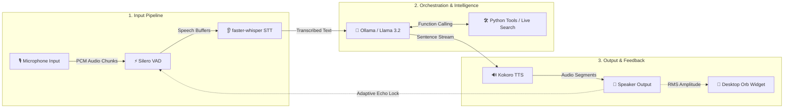

# Jarvis: Low-Latency Local Voice AI Assistant 🎙️🤖

[](#)
[](#)
[-8A2BE2.svg)](#)
[-FF6F00.svg?logo=ollama&logoColor=white)](#)
[-FF69B4.svg)](#)
[](#)

**Jarvis** is a low-latency, privacy-focused, local-first voice assistant engineered to run 100% locally on your machine. Featuring ultra-fast Voice Activity Detection (VAD), high-accuracy Speech-to-Text (STT), deterministic local LLM orchestration with live web search and tool execution, real-time streaming Text-to-Speech (TTS), and a floating animated Siri-like desktop orb widget.

---

## ⚡ Quick Start (3 Steps)

### 1. Install System Dependencies & Python Requirements
```bash
# macOS (via Homebrew)
brew install portaudio espeak-ng

# Linux (Debian/Ubuntu)
sudo apt-get update && sudo apt-get install -y portaudio19-dev alsa-utils libasound2-dev espeak-ng

# Install Python requirements
pip install -r requirements.txt
```

### 2. Pull Local LLM Model (Ollama)
Ensure [Ollama](https://ollama.com/) is installed and running locally, then pull the lightweight Llama 3.2 model:
```bash
ollama pull llama3.2
```

### 3. Launch Jarvis!
```bash
python main.py
```

---

## 🛠️ Architecture & Audio Pipeline

Jarvis runs as an asynchronous, event-driven pipeline designed to minimize end-to-end latency while eliminating feedback loops and echo self-transcription.



### Data Flow Breakdown
1. **🎙️ Speech Detection & Endpointing**: Microphone input is constantly evaluated by **Silero VAD** for sub-millisecond edge endpointing, isolating human speech from ambient background noise.
2. **👂 Async Speech Transcription**: Completed speech segments are passed to **faster-whisper** for low-latency asynchronous transcription.
3. **🧠 Intelligence & Tool Routing**: **Ollama (Llama 3.2)** processes the user prompt. Relevant local Python tools (real-time DuckDuckGo search, Yahoo Finance stocks, Google News RSS, weather, Wikipedia, time, smart home) are invoked deterministically.
4. **🔊 Streaming Audio Synthesis**: **Kokoro TTS** synthesizes text chunks sentence-by-sentence into low-latency audio buffers, instantly queued for speaker playback via PyAudio.
5. **🔮 Dynamic Visuals & Echo Protection**: Speaker audio drives real-time scaling on the floating **Desktop Orb Widget** while maintaining adaptive echo gating to suppress self-hearing.

---

## 🌟 Core Features & Highlights

* **⚡ Sub-100ms First-Syllable Latency**: Optimized background audio chunking, sentence-level regex streaming, Whisper VAD bypass, and greedy LLM decoding provide near-instant responses.
* **🔮 Animated Siri-Like Desktop Orb**: Borderless floating Tkinter UI widget that breathes when listening, sways when thinking, and dynamically scales in response to speaker amplitude. Drag and drop anywhere on your desktop.
* **🔒 100% Private & Local-First**: Core speech processing and language models run entirely locally. Auto-detects hardware acceleration (`MPS` for Apple Silicon, `CUDA` for NVIDIA GPUs). Web access is strictly transparent and tool-driven.
* **🔄 Flexible Barge-In Modes**: Interrupt the assistant seamlessly mid-speech. Supports `smart` (RMS volume-gated), `headphones` (full-duplex open mic), and `disabled` (half-duplex mic lock).
* **🛡️ Adaptive Echo & Loop Suppression**: Dynamic decay cooldown (`0.35s`) and amplitude gating prevent the assistant from transcribing its own output through microphone spillover.
* **🔧 Deterministic Tool Routing**: Tool execution layer eliminates hallucinated tool calls with fast pre-filtering for live search, financial market data, breaking news, weather, Wikipedia, smart home controls, and system utilities.

---

## 🌐 Real-Time Web & Tool Integration

Jarvis intelligently routes queries to local tools when real-time data or system interaction is required:

| Capability | Example Query | Tool Invoked | Data Source / Provider |
| :--- | :--- | :--- | :--- |
| **📈 Real-Time Stocks** | *"What is Tesla's stock price today?"* | `search_web` | Yahoo Finance API (`TSLA`, `AAPL`, `MSFT`, `GOOGL`, etc.) |
| **🌐 Live Web Search** | *"Who won the game today?"* | `search_web` | DuckDuckGo Search Engine API |
| **🏛️ Political & Current Leaders** | *"Who is the prime minister of Canada?"* | `search_web` | Real-time Search Engine |
| **📰 Breaking Global News** | *"What is the latest headline news?"* | `get_latest_news` | Google News RSS Feed |
| **📚 Fact & Knowledge Lookup** | *"Tell me about Quantum Computing"* | `search_wikipedia` | Wikipedia REST API |
| **☀️ Live Weather** | *"What's the weather in Tokyo?"* | `get_weather` | OpenWeather API |
| **💡 Smart Home Control** | *"Turn off the living room lights"* | `toggle_smart_lights` | Smart Home REST API |
| **⏰ System Utilities** | *"What time is it right now?"* | `get_current_time` | System Clock |

---

## 📁 Codebase Architecture & Files

* **[main.py](main.py)**: Orchestrator entry point. Initializes asynchronous worker loops, manages global signal handlers (`SIGINT`/`SIGTERM`), and handles main-thread Cocoa UI requirements.
* **[audio_engine.py](audio_engine.py)**: Manages PyAudio microphone input stream, executes Silero VAD edge processing, calculates RMS volume levels, and manages adaptive echo-suppression gating.
* **[stt_engine.py](stt_engine.py)**: Consumes speech audio buffers asynchronously from the VAD queue and produces transcribed text via `faster-whisper`.
* **[llm_engine.py](llm_engine.py)**: Handles conversation memory history, prompt engineering, regex sentence chunking, and deterministic function tool calling via Ollama API.
* **[tts_engine.py](tts_engine.py)**: Synthesizes text into high-quality speech using Kokoro TTS (MPS/CUDA hardware-accelerated) and streams audio segments to PyAudio speakers with real-time amplitude calculations.
* **[ui_engine.py](ui_engine.py)**: Floating Tkinter desktop widget rendering dynamic visual states (listening, thinking, speaking) with macOS alpha channel fixes and click-and-drag movement.
* **[test_jarvis.py](test_jarvis.py)**: Unit test suite covering deterministic tool keyword routing, memory buffer pruning, and tool parameter extraction.
* **[Dockerfile](Dockerfile)**: Linux container configuration for deploying Jarvis with host audio device passthrough.
* **[requirements.txt](requirements.txt)**: Managed Python library dependencies.

---

## 🏎️ Key Latency & Performance Optimizations

* **🎙️ Background Audio Chunk Streaming**: Kokoro TTS generation executes in a background thread and dispatches synthesized PCM frames via `loop.call_soon_threadsafe`, reducing audio output startup delay to under **50ms**.
* **🔇 Whisper VAD Bypass (`vad_filter=False`)**: Relying on primary Silero VAD endpoints for initial speech capture allows redundant second-pass filtering in Whisper to be disabled, eliminating **100–300ms** of transcription overhead.
* **⏳ Aggressive Silence Endpointing**: Silence threshold set to `0.35s` (down from `1.2s`), allowing transcription to initiate instantly upon speech completion.
* **🎨 macOS Cocoa Canvas Transparency Fix**: Standard transparent Tkinter canvases on macOS composite alpha channels against transparent windows. Resolved by rendering a dynamic white background oval (`canvas.create_oval`) matching the moving avatar's exact scale.
* **♻️ Tkinter Garbage Collection Preservation**: Prevents Python GC sweeps from dropping dynamic `PhotoImage` frame references by binding image instances directly to the canvas element (`self.canvas.image = self.avatar_img`).
* **⚡ Greedy LLM Inference**: Configured Ollama parameters with greedy decoding (`temperature: 0.0`), concise context (`num_ctx: 1024`), and bounded output length (`num_predict: 50`) to minimize generation latency.

---

## 🚀 Usage & Configuration Options

### Launch Modes
```bash
# Smart Mode (Default - RMS volume-gated barge-in for speakers)
python main.py

# Headphones Mode (Recommended for headphones - full-duplex open mic)
python main.py --barge-in headphones

# Disabled Mode (Traditional half-duplex mic lock during speech output)
python main.py --barge-in disabled
```

### Custom STT Model Selection
Choose from available Whisper model sizes (`tiny.en`, `base.en`, `small.en`, `medium.en`):
```bash
python main.py --stt-model small.en
```

### Standalone Desktop Widget Testing
Test UI animations, state transitions, and click-and-drag interactions independently:
```bash
python ui_engine.py
```

### Automated Unit Test Suite
Run the test suite to verify tool routing and memory management logic:
```bash
python -m unittest test_jarvis.py
```

### Containerized Deployment (Docker)
Build and run the assistant container with host audio driver access (Linux):
```bash
docker build -t local-voice-ai .
docker run -it --device /dev/snd --network host local-voice-ai
```

---

## 💻 Hardware Requirements

| Component | Minimum | Recommended |
| :--- | :--- | :--- |
| **RAM** | 8 GB | 16 GB+ (Apple Silicon or NVIDIA GPU) |
| **Storage** | 5 GB available | 10 GB (for multiple Whisper/Ollama models) |
| **Microphone** | Built-in mic | Dedicated directional USB mic or headset |
| **OS** | macOS 12+ / Linux | macOS 14+ (Apple Silicon M-series recommended) |

---

## 📜 Version History & Changelog

* **2026-08-04**: Upgraded default Whisper model to `base.en` and introduced the `--stt-model` CLI flag.
* **2026-08-04**: Implemented deterministic `get_relevant_tools` routing in `llm_engine.py` to eliminate tool calling hallucinations in Ollama / Llama 3.2.
* **2026-08-04**: Integrated real-time web search (`search_web`) via DuckDuckGo, stock lookups via Yahoo Finance, and live breaking news via Google News RSS (`get_latest_news`).
* **2026-08-04**: Added automatic web search routing for political leader queries and real-time facts.
* **2026-08-04**: Enhanced Desktop Orb UI with drag-to-repositioning, macOS Cocoa background transparency fix, MPS/CUDA auto-acceleration for Kokoro TTS, and conversation memory buffer pruning.

---

## 📄 License

Distributed under the **MIT License**. See `LICENSE` for more information.
