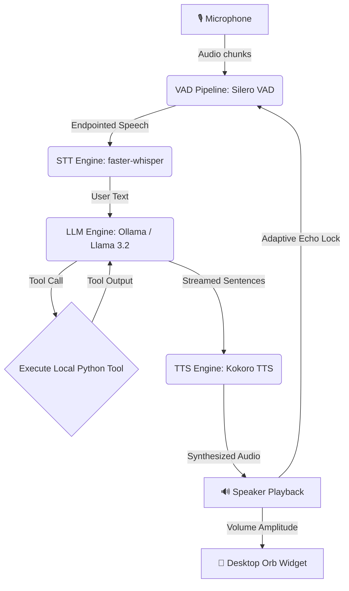

# Jarvis: Low-Latency Local Voice AI Assistant 🎙️🤖

[](#)
[](#)
[-blueviolet)](#)
[-orange)](#)
[-ff69b4)](#)
[](#)

Jarvis is a low-latency, fully offline, local voice assistant that runs entirely on your machine. It features highly responsive Voice Activity Detection (VAD), fast Speech-to-Text (STT) transcription, Language Model (LLM) orchestration with custom tool calling, real-time Text-to-Speech (TTS) audio streaming, and a gorgeous, Siri-like floating desktop widget that reacts in real-time.

---

## 🛠️ Architecture & Pipeline Flow

The system operates as an asynchronous, event-driven voice pipeline designed to prevent acoustic echo feedback and maximize real-time streaming performance.



---

## 🌟 Core Features

*   **⚡ Sub-100ms First-Syllable Latency**: Optimized using real-time audio chunk streaming, Whisper VAD-bypass, and fine-tuned Ollama configurations.
*   **🔮 Siri-Like Desktop Orb**: A borderless, floating UI widget that breathes when listening, sways when thinking, and pulsates/scales dynamically in direct response to speaker amplitude when speaking. Click and drag anywhere to move it across your desktop.
*   **🔒 100% Offline & Private**: All models (Silero VAD, faster-whisper STT, Llama 3.2 LLM, Kokoro TTS) run completely locally on your hardware. Supports Apple Silicon (`MPS`) and NVIDIA (`CUDA`) acceleration.
*   **🔄 Flexible Barge-In Modes**: Interrupt the assistant seamlessly mid-speech. Supports `smart` (RMS volume-gated), `headphones` (full-duplex open mic), and `disabled` (traditional half-duplex mic lock).
*   **🛡️ Echo & Loop Prevention**: Dynamic decay cooldown (`0.35s`) and amplitude gating prevent the assistant from transcribing its own speaker output.
*   **🔧 Deterministic Tool Routing**: Fast, keyword-gated function execution connects the assistant to live stock quotes (Yahoo Finance), web search (DuckDuckGo), real-time global news (Google News RSS), weather, Wikipedia, and system utilities without LLM hallucinations.

---

## 🌐 Integrated Real-Time Tools

Jarvis intelligently routes queries to local tools when real-time data or system interaction is required:

| Capability | Example Query | Tool Function | Data Source / Provider |
| :--- | :--- | :--- | :--- |
| **📈 Real-Time Stocks** | *"What is Tesla's stock price today?"* | `search_web` | Yahoo Finance API (`TSLA`, `AAPL`, `NVDA`, `MSFT`) |
| **🌐 Live Web Search** | *"Who won the game yesterday?"* | `search_web` | DuckDuckGo Search Engine API |
| **🏛️ Political & Current Facts** | *"Who is the prime minister of Canada?"* | `search_web` | Real-time Search Engine |
| **📰 Breaking Global News** | *"What is the latest headline news?"* | `get_latest_news` | Google News RSS Feed |
| **📚 Fact & Knowledge Lookup** | *"Tell me about Quantum Computing"* | `search_wikipedia` | Wikipedia REST API |
| **☀️ Live Weather** | *"What's the weather in Tokyo?"* | `get_weather` | OpenWeather API |
| **💡 Smart Home Control** | *"Turn off the living room lights"* | `toggle_smart_lights` | Smart Home REST API |
| **⏰ System Utilities** | *"What time is it right now?"* | `get_current_time` | System Clock |

---

## 📁 Codebase Directory Breakdown

*   [main.py](file:///Users/saikrishnaallam/Desktop/jarvis_ai/main.py) - The orchestrator that initializes all modules and launches asynchronous worker loops concurrently.
*   [audio_engine.py](file:///Users/saikrishnaallam/Desktop/jarvis_ai/audio_engine.py) - Handles microphone input, runs Silero VAD, manages the feedback/echo locks, and detects user speech onset.
*   [stt_engine.py](file:///Users/saikrishnaallam/Desktop/jarvis_ai/stt_engine.py) - Consumes speech buffers from the VAD queue and transcribes them asynchronously using `faster-whisper`.
*   [llm_engine.py](file:///Users/saikrishnaallam/Desktop/jarvis_ai/llm_engine.py) - Asynchronously coordinates conversation history, streams text responses sentence-by-sentence, and manages local tool calling.
*   [tts_engine.py](file:///Users/saikrishnaallam/Desktop/jarvis_ai/tts_engine.py) - Synthesizes spoken audio using Kokoro TTS and streams audio segments to the audio driver immediately as they are generated.
*   [ui_engine.py](file:///Users/saikrishnaallam/Desktop/jarvis_ai/ui_engine.py) - A Tkinter-based floating desktop widget providing live, animated visual feedback of the assistant's internal state.
*   [test_jarvis.py](file:///Users/saikrishnaallam/Desktop/jarvis_ai/test_jarvis.py) - Automated unit test suite covering tool keyword routing, memory buffer pruning, and parameter extraction.
*   [Dockerfile](file:///Users/saikrishnaallam/Desktop/jarvis_ai/Dockerfile) - Linux container configuration for deploying Jarvis with host audio device passthrough.
*   [requirements.txt](file:///Users/saikrishnaallam/Desktop/jarvis_ai/requirements.txt) - Managed Python library dependencies.
*   [.gitignore](file:///Users/saikrishnaallam/Desktop/jarvis_ai/.gitignore) - Git ignore rules for bytecode, virtual environments, and OS metadata files.

---

## 🏎️ Core Latency & UX Optimizations

We implemented several key refinements to ensure the voice agent is highly conversational and fluid:
1.  **Audio Streaming**: Synthesis is streamed clause-by-clause using background threads, meaning the speaker starts playing the beginning of a sentence before the end of the sentence has finished synthesizing.
2.  **Whisper VAD-Bypass**: By relying strictly on our primary Silero VAD endpoints, we bypassed redundant secondary VAD filtration in `faster-whisper`, shaving off `100-300ms` per turn.
3.  **Low VAD Endpointing Threshold**: Reduced silence endpointing detection to `0.35s` (down from `1.2s`) to start transcription almost instantly when you finish speaking.
4.  **Greedy LLM Decoding**: Configured Ollama requests to use greedy decoding (`temperature: 0.0`), a smaller context history window (`num_ctx: 1024`), and short predict bounds to minimize context load latency.
5.  **Cocoa Compositing Fix**: Added a solid canvas background oval behind the circular PNG avatar to resolve macOS-specific transparency rendering bugs that make transparent PNGs invisible on transparent Tkinter canvases.
6.  **Tkinter Garbage Collection Preservation**: Bound image references directly to the canvas element (`self.canvas.image = self.avatar_img`) to prevent garbage collector sweeps from dropping active frame buffers.

---

## 📦 Requirements & Local Installation

### Hardware Requirements
*   **Disk Space**: ~4.5 GB to 7.2 GB (Whisper, Kokoro, and Ollama Llama 3.2 model storage).
*   **RAM**: 8 GB minimum (16 GB recommended for GPU acceleration).
*   **OS**: macOS 12+ (Apple Silicon recommended) or Linux (Ubuntu 22.04+).

### System Dependencies
Ensure you have the PortAudio and system text-to-speech libraries installed:
*   **macOS (Homebrew)**:
    ```bash
    brew install portaudio espeak-ng
    ```
*   **Linux (Debian/Ubuntu)**:
    ```bash
    sudo apt-get update && sudo apt-get install -y portaudio19-dev alsa-utils libasound2-dev espeak-ng
    ```

### Installation Steps

1.  **Install Python Packages**:
    ```bash
    pip install -r requirements.txt
    ```
2.  **Start Ollama Server**: Make sure your local [Ollama](https://ollama.com/) instance is running and pull the lightweight Llama 3.2 model:
    ```bash
    ollama pull llama3.2
    ```

---

## 🚀 Running the Application

### Start the full Assistant:
```bash
# Default Smart Mode (RMS volume-gated barge-in for speakers)
python main.py

# Headphones Mode (Recommended for headphones - full-duplex open mic)
python main.py --barge-in headphones

# Disabled Mode (Traditional half-duplex mic lock during speech output)
python main.py --barge-in disabled
```

### Custom STT Model Selection:
Choose from available Whisper model sizes (`tiny.en`, `base.en`, `small.en`, `medium.en`):
```bash
python main.py --stt-model small.en
```

### Standalone UI Testing:
To test the floating desktop widget in isolation (which cycles through visual states and tests dynamic avatar scaling), run:
```bash
python ui_engine.py
```

### Docker Deployment (Linux only):
To build and run the assistant container, exposing your audio hardware driver:
```bash
docker build -t local-voice-ai .
docker run -it --device /dev/snd --network host local-voice-ai
```

---

## 🧪 Running Unit Tests

Run the automated test suite to verify tool routing and memory management logic:
```bash
python -m unittest test_jarvis.py
```

---

## 📜 Version History & Changelog

*   **2026-08-04**: Upgraded default Whisper model to `base.en` and introduced `--stt-model` CLI flag.
*   **2026-08-04**: Implemented deterministic `get_relevant_tools` routing in `llm_engine.py` to eliminate tool calling hallucinations in Ollama / Llama 3.2.
*   **2026-08-04**: Integrated real-time web search (`search_web`) via DuckDuckGo, stock lookups via Yahoo Finance, and live breaking news via Google News RSS (`get_latest_news`).
*   **2026-08-04**: Added automatic web search routing for political leader queries and real-time facts.
*   **2026-08-04**: Enhanced Desktop Orb UI with drag-to-repositioning, macOS Cocoa background transparency fix, MPS/CUDA auto-acceleration for Kokoro TTS, and conversation memory buffer pruning.

---

## 📄 License

Distributed under the **MIT License**. See `LICENSE` for more information.
